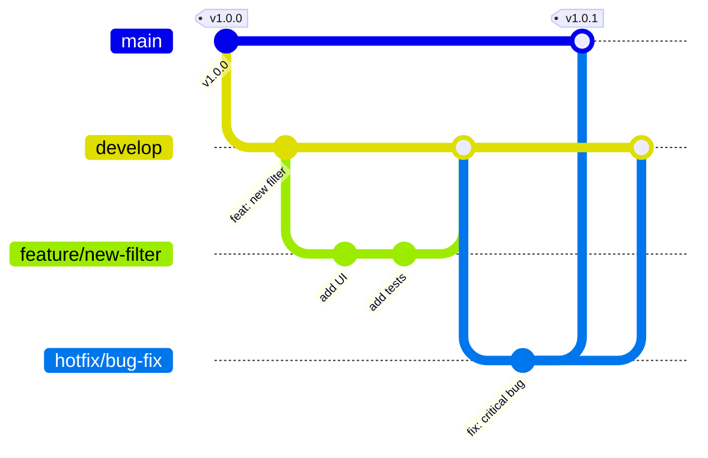

# 🤝 Contributing Guide

Руководство для разработчиков CGM Dashboard.

---

## 📋 Содержание

- [Начало работы](#начало-работы)
- [Git Workflow](#git-workflow)
- [Структура проекта](#структура-проекта)
- [Code Style](#code-style)
- [Pull Request Process](#pull-request-process)
- [Commit Message Format](#commit-message-format)
- [Testing](#testing)

---

## Git Workflow

### Branching Model



---

### Pull Request Flow

```mermaid
flowchart LR
    subgraph "Developer"
        Branch[🌿 Create branch<br/>feature/*]
        Commit[💾 Make commits<br/>conventional]
        Push[📤 Push to GitHub]
    end
    
    subgraph "GitHub"
        PR[📋 Create PR<br/>Fill template]
        Review[👀 Code review<br/>1+ approvals]
        CI[🤖 CI checks<br/>All green]
    end
    
    subgraph "Merge"
        Merge[🔀 Merge to develop<br/>Squash commits]
        Delete[🗑️ Delete branch]
    end
    
    Branch --> Commit
    Commit --> Push
    Push --> PR
    PR --> Review
    Review --> CI
    CI --> Merge
    Merge --> Delete
```

---

## Начало работы

### Предварительные требования

- **Python 3.14+**
- **Node.js 20+**
- **PostgreSQL 17+**
- **Git**

### Установка

```bash
# Клонировать репозиторий
git clone <repository-url>
cd cgm_goszakupki

# Backend
cd backend
pip install -r requirements.txt

# Frontend
cd frontend
npm install
```

### Запуск development среды

```bash
# Terminal 1: Backend
cd backend
uvicorn main:app --reload --port 8000

# Terminal 2: Frontend
cd frontend
npm run dev

# Terminal 3: PostgreSQL (если не запущен)
& "C:\Program Files\PostgreSQL\17\bin\pg_ctl.exe" start -D "C:\pg_data"
```

---

## Структура проекта

```
cgm_goszakupki/
├── backend/
│   ├── main.py              # FastAPI приложение
│   ├── tests/               # Тесты
│   └── requirements.txt     # Python зависимости
│
├── frontend/
│   ├── src/
│   │   ├── api/             # API клиент
│   │   ├── components/      # React компоненты
│   │   ├── stores/          # Zustand stores
│   │   └── App.tsx          # Главный компонент
│   ├── tests/
│   │   └── e2e/             # E2E тесты
│   └── package.json         # Node зависимости
│
├── docs/                    # Документация
├── docker-compose.yml       # Docker конфигурация
└── README.md                # Основная документация
```

---

## Code Style

### Python

**Инструменты:** flake8, black

```bash
# Проверка
flake8 backend/

# Форматирование
black backend/
```

**Правила:**
- 4 пробела для отступов
- Макс. длина строки: 88 символов
- Docstrings для функций и классов
- Type hints для всех функций

**Пример:**
```python
from typing import Optional, List
from fastapi import FastAPI

app = FastAPI()


@app.post("/api/kpi")
def get_kpi(filters: Optional[dict] = None) -> dict:
    """
    Получить KPI метрики.
    
    Args:
        filters: Параметры фильтрации
        
    Returns:
        KPI данные
    """
    if filters is None:
        filters = {}
    
    return {"total_amount": 1000000}
```

---

### TypeScript/React

**Инструменты:** ESLint, Prettier

```bash
# Проверка
npm run lint

# Форматирование
npx prettier --write src/
```

**Правила:**
- 2 пробела для отступов
- Макс. длина строки: 100 символов
- TypeScript strict mode
- Функциональные компоненты
- Hooks вместо class components

**Пример:**
```typescript
import { useState, useCallback } from 'react';
import { Button } from '@mui/material';

interface KpiCardProps {
  title: string;
  value: number;
  loading?: boolean;
}

export const KpiCard = ({ title, value, loading = false }: KpiCardProps) => {
  const [selected, setSelected] = useState(false);

  const handleClick = useCallback(() => {
    setSelected(!selected);
  }, [selected]);

  if (loading) {
    return <div>Загрузка...</div>;
  }

  return (
    <Button onClick={handleClick}>
      {title}: {value}
    </Button>
  );
};
```

---

### SQL

**Правила:**
- Ключевые слова UPPER CASE
- Названия таблиц/колонок snake_case
- Индексы: `idx_<table>_<column>`

**Пример:**
```sql
CREATE INDEX IF NOT EXISTS idx_purchase_year
ON purchases(year);

SELECT
    p.customer_name,
    SUM(p.amount_rub) as total_amount
FROM purchases p
WHERE p.year = 2024
GROUP BY p.customer_name
ORDER BY total_amount DESC;
```

---

## Git Workflow

### Ветки

```
main          # Production версия
develop       # Development версия
feature/*     # Новые функции
bugfix/*      # Исправления багов
hotfix/*      # Срочные исправления
```

### Процесс

```bash
# Создать ветку для фичи
git checkout develop
git checkout -b feature/new-filter

# Внести изменения
git add .
git commit -m "feat: добавить фильтр по заказчикам"

# Отправить на GitHub
git push origin feature/new-filter

# Создать Pull Request
```

---

## Pull Request Process

### Чеклист перед PR

- [ ] Код отформатирован
- [ ] Тесты проходят
- [ ] Coverage не уменьшился
- [ ] Документация обновлена
- [ ] Нет console.log в коде

### Описание PR

```markdown
## Описание
Добавляет фильтр по заказчикам в панель фильтров.

## Изменения
- Добавлен Autocomplete для заказчиков
- Обновлён filterStore
- Добавлены тесты

## Тестирование
- [x] Unit тесты
- [x] Component тесты
- [x] E2E тесты

## Скриншоты
<!-- Если есть изменения UI -->
```

### Code Review

**Требования:**
- Минимум 1 аппрув
- Все комментарии решены
- CI pipeline зелёный

---

## Commit Message Format

### Формат

```
<type>(<scope>): <description>

[optional body]

[optional footer]
```

### Типы коммитов

| Тип | Описание |
|-----|----------|
| `feat` | Новая функция |
| `fix` | Исправление бага |
| `docs` | Изменения документации |
| `style` | Форматирование, отступы |
| `refactor` | Рефакторинг кода |
| `test` | Добавление тестов |
| `chore` | Изменения сборки, зависимости |

### Примеры

```bash
# Новая функция
git commit -m "feat(filters): добавить фильтр по заказчикам"

# Исправление бага
git commit -m "fix(heatmap): исправить 500 ошибку при фильтрах"

# Обновление документации
git commit -m "docs: обновить README.md"

# Рефакторинг
git commit -m "refactor(api): упростить обработку ошибок"

# Тесты
git commit -m "test(kpi): добавить тесты для валидации"
```

---

## Testing

### Backend тесты

```bash
cd backend

# Запустить все тесты
pytest tests/

# С coverage
pytest tests/ --cov=main --cov-report=term-missing

# Конкретный тест
pytest tests/test_kpi.py::test_kpi_no_filters
```

### Frontend тесты

```bash
cd frontend

# Unit тесты
npm run test

# С coverage
npm run test:coverage

# E2E тесты
npm run test:e2e
```

### Требования к тестам

| Тип | Мин. покрытие |
|-----|---------------|
| Backend | 60% |
| Frontend | 50% |
| E2E | 10+ сценариев |

---

## Добавление новой функции

### Пример: Добавить новый фильтр

1. **Создать ветку:**
```bash
git checkout -b feature/product-filter
```

2. **Обновить store:**
```typescript
// stores/filterStore.ts
interface FilterState {
  selectedProducts: string[];
  availableProducts: string[];
  toggleProduct: (product: string) => void;
}
```

3. **Добавить компонент:**
```tsx
// components/filters/FilterPanel.tsx
<Autocomplete
  multiple
  options={availableProducts}
  value={selectedProducts}
  onChange={(_, newValue) => {
    // logic
  }}
  renderInput={(params) => <TextField {...params} />}
/>
```

4. **Обновить API:**
```typescript
// api/index.ts
getProductsList: async (): Promise<string[]> => {
  const response = await apiClient.get<string[]>('/filters/products');
  return response.data;
}
```

5. **Добавить тесты:**
```typescript
// components/filters/__tests__/FilterPanel.test.tsx
it('фильтр по продуктам работает', () => {
  // test logic
});
```

6. **Обновить документацию:**
```markdown
// docs/API.md
### GET /api/filters/products
Список доступных продуктов.
```

7. **Создать PR:**
```bash
git add .
git commit -m "feat(filters): добавить фильтр по продуктам"
git push origin feature/product-filter
```

---

## Устранение проблем

### Конфликты слияния

```bash
# Обновить ветку
git fetch origin
git rebase origin/develop

# Разрешить конфликты
# ... edit files ...
git add .
git rebase --continue
```

### Отмена коммита

```bash
# Отменить последний коммит (сохранить изменения)
git reset --soft HEAD~1

# Отменить коммит (удалить изменения)
git reset --hard HEAD~1
```

### Исправление коммита

```bash
# Изменить последний коммит
git commit --amend -m "feat: правильное описание"

# Если уже отправлен
git push --force-with-lease
```

---

## Релизный процесс

### Подготовка релиза

1. Обновить версию в `package.json` и `pyproject.toml`
2. Обновить `CHANGELOG.md`
3. Запустить все тесты
4. Создать тег

```bash
git tag -a v1.0.0 -m "Release v1.0.0"
git push origin v1.0.0
```

### Changelog формат

```markdown
## [1.0.0] - 2026-03-05

### Добавлено
- Фильтр по заказчикам
- E2E тесты

### Исправлено
- Ошибка 500 в heatmap
- Белый фон sidebar

### Изменено
- Увеличен лимит строк: 200 → 500
```

---

## Контакты

- **Вопросы:** Создать issue на GitHub
- **Предложения:** Обсудить в Discussions
- **Баги:** Report bug issue с шагами воспроизведения

---

## Лицензия

Внутренний проект для компании.
