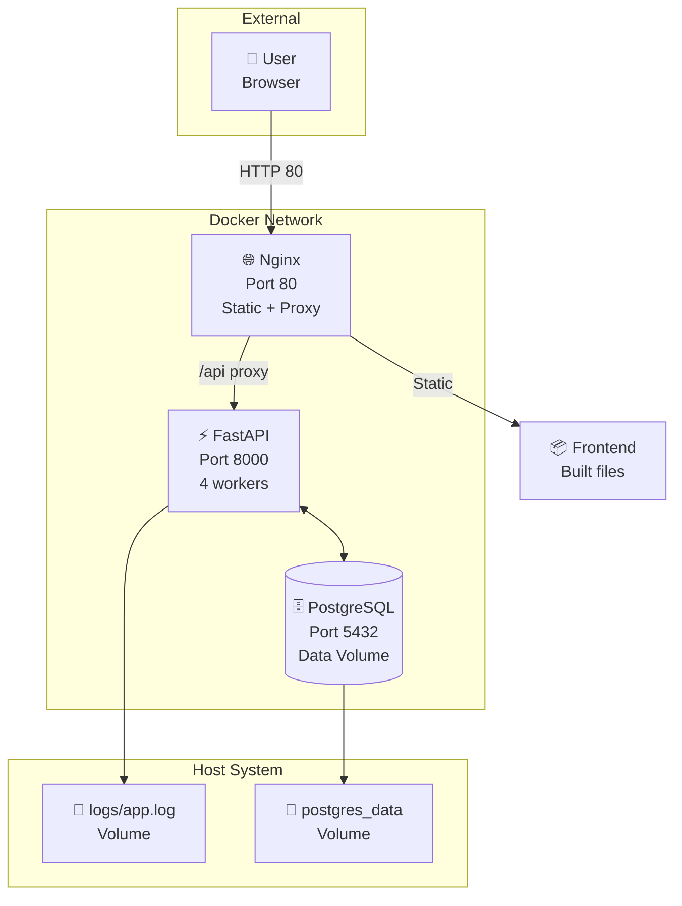

# 🚀 CGM Dashboard - Руководство по развёртыванию

## Архитектура развёртывания

### Docker Compose



---

## Быстрый старт с Docker

### Предварительные требования

- Docker 20+
- Docker Compose 2.0+

### 1. Клонирование репозитория

```bash
git clone <repository-url>
cd cgm_goszakupki
```

### 2. Настройка переменных окружения

Создайте файл `.env` в корне проекта:

```bash
# PostgreSQL
POSTGRES_USER=postgres
POSTGRES_PASSWORD=your_secure_password_here
POSTGRES_DATABASE=cgm_dashboard
POSTGRES_PORT=5432

# Backend
BACKEND_PORT=8000

# Frontend
FRONTEND_PORT=80
```

### 3. Запуск всех сервисов

```bash
docker-compose up -d
```

### 4. Проверка статуса

```bash
docker-compose ps
```

Ожидаемый вывод:
```
NAME            STATUS         PORTS
cgm-backend     Up (healthy)   0.0.0.0:8000->8000/tcp
cgm-frontend    Up (healthy)   0.0.0.0:80->80/tcp
cgm-postgres    Up (healthy)   0.0.0.0:5432->5432/tcp
```

### 5. Доступ к приложению

- **Frontend:** http://localhost
- **Backend API:** http://localhost:8000
- **API Docs (Swagger):** http://localhost:8000/docs

### 6. Остановка сервисов

```bash
docker-compose down
```

### 7. Остановка с удалением данных

```bash
docker-compose down -v
```

---

## Локальная разработка (без Docker)

### Backend

```bash
cd backend
pip install -r requirements.txt
uvicorn main:app --reload --host 0.0.0.0 --port 8000
```

### Frontend

```bash
cd frontend
npm install
npm run dev
```

---

## Production развёртывание

### Docker Swarm

```bash
# Инициализация swarm
docker swarm init

# Развёртывание стека
docker stack deploy -c docker-compose.yml cgm

# Проверка статуса
docker stack ps cgm

# Просмотр логов
docker service logs cgm_backend
docker service logs cgm_frontend
```

### Kubernetes

Создайте манифесты в директории `k8s/`:

```yaml
# k8s/deployment.yaml
apiVersion: apps/v1
kind: Deployment
metadata:
  name: cgm-backend
spec:
  replicas: 3
  selector:
    matchLabels:
      app: cgm-backend
  template:
    metadata:
      labels:
        app: cgm-backend
    spec:
      containers:
      - name: backend
        image: your-registry/cgm-backend:latest
        ports:
        - containerPort: 8000
        env:
        - name: POSTGRES_HOST
          value: postgres-service
        # ... остальные переменные
```

```bash
kubectl apply -f k8s/
```

---

## Мониторинг и логи

### Просмотр логов

```bash
# Backend логи
docker-compose logs -f backend

# Frontend логи
docker-compose logs -f frontend

# Database логи
docker-compose logs -f postgres
```

### Health checks

```bash
# Backend health
curl http://localhost:8000/api/health

# Frontend health
curl http://localhost/
```

---

## Backup базы данных

### Создание backup

```bash
docker exec cgm-postgres pg_dump -U postgres cgm_dashboard > backup_$(date +%Y%m%d).sql
```

### Восстановление из backup

```bash
cat backup_20240101.sql | docker exec -i cgm-postgres psql -U postgres cgm_dashboard
```

---

## Обновление приложения

```bash
# Остановка старых контейнеров
docker-compose down

# Сборка новых образов
docker-compose build --no-cache

# Запуск новых контейнеров
docker-compose up -d

# Удаление старых образов
docker image prune -f
```

---

## Устранение проблем

### Backend не запускается

```bash
# Проверка логов
docker-compose logs backend

# Проверка подключения к БД
docker exec -it cgm-backend python -c "import psycopg2; psycopg2.connect(host='postgres', user='postgres', password='your_password', database='cgm_dashboard')"
```

### Frontend не загружается

```bash
# Проверка логов nginx
docker-compose logs frontend

# Проверка подключения к backend
docker exec -it cgm-frontend wget -qO- http://backend:8000/api/health
```

### Database ошибки

```bash
# Перезапуск PostgreSQL
docker-compose restart postgres

# Проверка статуса
docker exec -it cgm-postgres pg_isready
```

---

## Переменные окружения

| Переменная | Описание | По умолчанию |
|------------|----------|--------------|
| `POSTGRES_USER` | Пользователь БД | `postgres` |
| `POSTGRES_PASSWORD` | Пароль БД | `changeme` |
| `POSTGRES_DATABASE` | Имя БД | `cgm_dashboard` |
| `POSTGRES_PORT` | Порт БД | `5432` |
| `POSTGRES_HOST` | Хост БД | `localhost` |
| `BACKEND_PORT` | Порт backend API | `8000` |
| `FRONTEND_PORT` | Порт frontend | `80` |
| `ALLOWED_ORIGINS` | CORS whitelist | `http://localhost:5173,http://localhost:80` |
| `REDIS_HOST` | Redis хост (опционально) | `localhost` |
| `REDIS_PORT` | Redis порт (опционально) | `6379` |

---

## Безопасность

### Реализованные меры (7 марта 2026)

1. **CORS whitelist** — Разрешены только доверенные домены
   ```python
   allowed_origins = os.getenv("ALLOWED_ORIGINS", "http://localhost:5173,http://localhost:80").split(",")
   ```

2. **Rate Limiting** — Ограничение запросов для защиты от DDoS
   - Health endpoint: 30 запросов/минуту
   - API endpoints: 60 запросов/минуту

3. **Валидация данных** — Pydantic модели с проверкой:
   - Годы: 1900-2100
   - Месяцы: 1-12
   - Строки: макс. 500 символов
   - Даты: формат YYYY-MM-DD

### Рекомендации для production

4. **Используйте secrets** для чувствительных данных в Docker
5. **Настройте firewall** для ограничения доступа к портам
6. **Включите HTTPS** через reverse proxy (nginx, traefik)
7. **Регулярно обновляйте** зависимости

---

## Контакты

По вопросам развёртывания обращайтесь к команде разработки.
