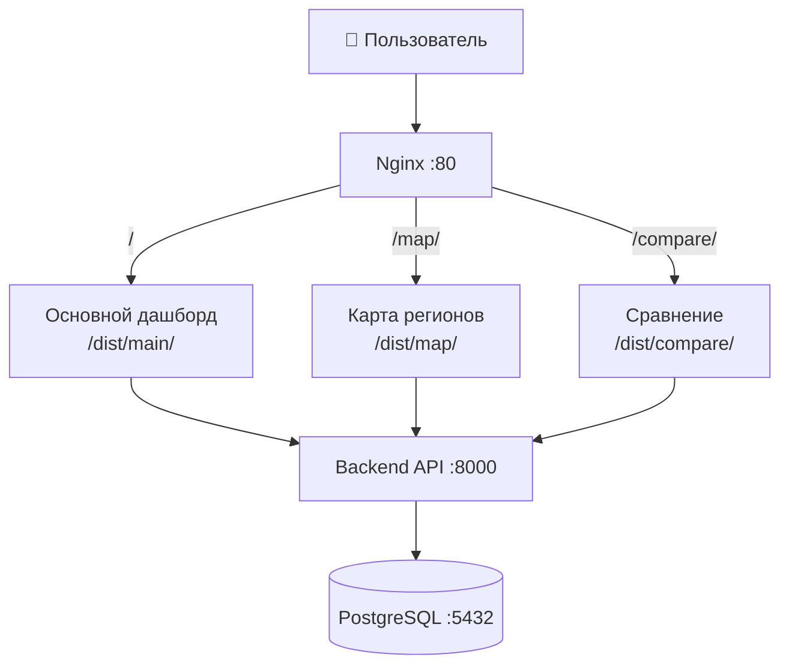

# 🚀 План реализации единого портала CGM Dashboard

**Версия:** 1.0  
**Дата:** 20 марта 2026  
**Статус:** ⏳ План  
**Оценка времени:** 6-8 часов  
**Сложность:** Средняя

---

## 📋 СОДЕРЖАНИЕ

- [Обзор решения](#обзор-решения)
- [Архитектура](#архитектура)
- [Этапы реализации](#этапы-реализации)
- [Чек-лист готовности](#чек-лист-готовности)
- [Тестирование](#тестирование)
- [Развёртывание](#развёртывание)

---

## 🎯 ОБЗОР РЕШЕНИЯ

### Текущее состояние (AS-IS)

```
┌─────────────┐     ┌─────────────┐     ┌─────────────┐
│ Порт 5173   │     │ Порт 5174   │     │ Порт 5175   │
│ Основной    │     │ Карта       │     │ Сравнение   │
│ http://:5173│     │ http://:5174│     │ http://:5175│
└─────────────┘     └─────────────┘     └─────────────┘
```

**Проблемы:**
- ❌ Пользователь должен помнить 3 разных URL
- ❌ Нет быстрого переключения между дашбордами
- ❌ Нет единой точки входа

### Целевое состояние (TO-BE)

```
┌─────────────────────────────────────────────────────┐
│              CGM Dashboard Portal                    │
│  📊 Основной  |  🗺️ Карта  |  📈 Сравнение          │
├─────────────────────────────────────────────────────┤
│                                                     │
│                  Контент дашборда                   │
│                                                     │
└─────────────────────────────────────────────────────┘
                    ↓
        http://localhost:80/
        http://localhost:80/map/
        http://localhost:80/compare/
```

**Преимущества:**
- ✅ Один URL для всех дашбордов
- ✅ Переключение в 1 клик
- ✅ Единая навигация
- ✅ Согласованный UX

---

## 🏗 АРХИТЕКТУРА

### Структура проекта после изменений

```
cgm_goszakupki/
├── dist/                          # 🆕 Единая папка сборки
│   ├── main/                      # Основной дашборд
│   ├── map/                       # Карта регионов
│   └── compare/                   # Сравнение периодов
│
├── frontend/                      # Исходный код основного
├── frontend_map/                  # Исходный код карты
├── frontend_compare/              # Исходный код сравнения
│
├── nginx/                         # 🆕 Конфигурация nginx
│   └── nginx.conf
│
└── docker-compose.yml             # 🆕 Обновлённая конфигурация
```

### Схема маршрутизации



---

## 📝 ЭТАПЫ РЕАЛИЗАЦИИ

### Этап 1: Подготовка (30 минут)

**Задачи:**
- [ ] 1.1 Создать папку `dist/` в корне проекта
- [ ] 1.2 Создать `.gitignore` для `dist/`
- [ ] 1.3 Обновить документацию

**Файлы:**
```bash
# Создать структуру
mkdir dist
mkdir dist/main
mkdir dist/map
mkdir dist/compare
```

**`.gitignore` (добавить):**
```gitignore
# Build outputs
dist/
*/dist/
```

---

### Этап 2: Обновление конфигурации Vite (1 час)

**Задачи:**
- [ ] 2.1 Обновить `frontend/vite.config.ts`
- [ ] 2.2 Обновить `frontend_map/vite.config.ts`
- [ ] 2.3 Обновить `frontend_compare/vite.config.ts`
- [ ] 2.4 Настроить base path для каждого дашборда

#### 2.1 Основной дашборд

**Файл:** `frontend/vite.config.ts`

```typescript
import { defineConfig } from 'vite'
import react from '@vitejs/plugin-react'

export default defineConfig({
  plugins: [react()],
  base: '/',  // Корневой путь
  server: {
    host: '0.0.0.0',
    port: 5173,
    proxy: {
      '/api': {
        target: 'http://localhost:8000',
        changeOrigin: true,
      },
    },
  },
  build: {
    outDir: '../dist/main',  // 🆕 Сборка в dist/main
    emptyOutDir: true,
    rollupOptions: {
      output: {
        manualChunks: {
          vendor: ['react', 'react-dom'],
          charts: ['recharts'],
          ui: ['@mui/material', '@mui/icons-material'],
        },
      },
    },
  },
})
```

#### 2.2 Карта регионов

**Файл:** `frontend_map/vite.config.ts`

```typescript
import { defineConfig } from 'vite'
import react from '@vitejs/plugin-react'

export default defineConfig({
  plugins: [react()],
  base: '/map/',  // 🆕 Путь для карты
  server: {
    host: '0.0.0.0',
    port: 5174,
    proxy: {
      '/api': {
        target: 'http://localhost:8000',
        changeOrigin: true,
      },
    },
  },
  build: {
    outDir: '../dist/map',  // 🆕 Сборка в dist/map
    emptyOutDir: true,
    rollupOptions: {
      output: {
        manualChunks: {
          vendor: ['react', 'react-dom'],
          maps: ['leaflet', 'react-leaflet'],
          ui: ['@mui/material', '@mui/icons-material'],
        },
      },
    },
  },
})
```

#### 2.3 Сравнение периодов

**Файл:** `frontend_compare/vite.config.ts`

```typescript
import { defineConfig } from 'vite'
import react from '@vitejs/plugin-react'

export default defineConfig({
  plugins: [react()],
  base: '/compare/',  // 🆕 Путь для сравнения
  server: {
    host: '0.0.0.0',
    port: 5175,
    proxy: {
      '/api': {
        target: 'http://localhost:8000',
        changeOrigin: true,
      },
    },
  },
  build: {
    outDir: '../dist/compare',  // 🆕 Сборка в dist/compare
    emptyOutDir: true,
    rollupOptions: {
      output: {
        manualChunks: {
          vendor: ['react', 'react-dom'],
          charts: ['recharts'],
          pdf: ['html2pdf.js'],
          ui: ['@mui/material', '@mui/icons-material'],
        },
      },
    },
  },
})
```

---

### Этап 3: Создание навигационной панели (2.5 часа)

**Важное уточнение:** Расположение навигации отличается для разных дашбордов из-за различной существующей структуры.

#### Визуальная схема расположения

```
╔═══════════════════════════════════════════════════════════════════════════════╗
║                           ОСНОВНОЙ ДАШБОРД (frontend/)                        ║
╠═══════════════════════════════════════════════════════════════════════════════╣
║ ┌───────────────────────────────────────────────────────────────────────────┐ ║
║ │ NavBar (fixed, 64px)                                                      │ ║
║ │ CGM Dashboard    📊 Основной | 🗺️ Карта | 📈 Сравнение                   │ ║
║ └───────────────────────────────────────────────────────────────────────────┘ ║
║ ┌───────────────────────────────────────────────────────────────────────────┐ ║
║ │ Заголовок (56px)                                                          │ ║
║ │ 📊 CGM Dashboard — Проект госзакупок                                      │ ║
║ └───────────────────────────────────────────────────────────────────────────┘ ║
║ ┌─────────────┐  ┌──────────────────────────────────────────────────────────┐ ║
║ │ Фильтры     │  │ KPI Панель                                               │ ║
║ │ (sidebar)   │  │ ┌────┐ ┌────┐ ┌────┐ ┌────┐ ┌────┐ ┌────┐              │ ║
║ │             │  │ └────┘ └────┘ └────┘ └────┘ └────┘ └────┘              │ ║
║ └─────────────┘  └──────────────────────────────────────────────────────────┘ ║
║                                                                                ║
║  ИТОГО: 120px сверху (64px NavBar + 56px заголовок)                           ║
╚═══════════════════════════════════════════════════════════════════════════════╝

╔═══════════════════════════════════════════════════════════════════════════════╗
║                    КАРТА РЕГИОНОВ (frontend_map/)                             ║
╠═══════════════════════════════════════════════════════════════════════════════╣
║ ┌───────────────────────────────────────────────────────────────────────────┐ ║
║ │ .map-header (интегрированный NavBar, 140px)                               ║
║ │ ┌───────────────────────────────────────────────────────────────────────┐ │ ║
║ │ │ CGM Dashboard    📊 Основной | 🗺️ Карта | 📈 Сравнение  (NavBar)     │ │ ║
║ │ │ ───────────────────────────────────────────────────────────────────── │ │ ║
║ │ │ 🗺️ CGM Dashboard — Карта закупок                      (Заголовок)    │ │ ║
║ │ │ Интерактивная карта госзакупок...                     (Подзаголовок) │ │ ║
║ │ │                                                                       │ │ ║
║ │ │ [Фильтры: Год, Продукты, Поставщик]  [Сбросить]      (HeaderFilters)│ │ ║
║ │ └───────────────────────────────────────────────────────────────────────┘ │ ║
║ │ ┌───────────────────────────────────────────────────────────────────────┐ │ ║
║ │ │ Активные фильтры: [Год: 2024] [Регион: Москва...]    (active-filters)│ │ ║
║ │ └───────────────────────────────────────────────────────────────────────┘ │ ║
║ └───────────────────────────────────────────────────────────────────────────┘ ║
║ ┌───────────────────────────────────────────────────────────────────────────┐ ║
║ │ Карта (Leaflet)                                                           │ ║
║ └───────────────────────────────────────────────────────────────────────────┘ ║
║                                                                                ║
║  ИТОГО: 140px хедер (NavBar интегрирован в существующий .map-header)          ║
╚═══════════════════════════════════════════════════════════════════════════════╝

╔═══════════════════════════════════════════════════════════════════════════════╗
║                    СРАВНЕНИЕ ПЕРИОДОВ (frontend_compare/)                     ║
╠═══════════════════════════════════════════════════════════════════════════════╣
║ ┌───────────────────────────────────────────────────────────────────────────┐ ║
║ │ Хедер (интегрированный NavBar, 140px)                                     ║
║ │ ┌───────────────────────────────────────────────────────────────────────┐ ║ ║
║ │ │ CGM Dashboard    📊 Основной | 🗺️ Карта | 📈 Сравнение  (NavBar)     │ ║ ║
║ │ │ ───────────────────────────────────────────────────────────────────── │ ║ ║
║ │ │ 📈 Сравнение периодов                                   (Заголовок)  │ ║ ║
║ │ │                                                                       │ ║ ║
║ │ │ [Фильтры периода А]  [🔄]  [Фильтры периода Б]       (PeriodFilters) │ ║ ║
║ │ └───────────────────────────────────────────────────────────────────────┘ ║ ║
║ └───────────────────────────────────────────────────────────────────────────┘ ║
║ ┌───────────────────────────────────────────────────────────────────────────┐ ║
║ │ KPI Panel с индикаторами изменений                                        ║
║ └───────────────────────────────────────────────────────────────────────────┘ ║
║                                                                                ║
║  ИТОГО: 140px хедер (NavBar интегрирован в существующий хедер)                ║
╚═══════════════════════════════════════════════════════════════════════════════╝
```

---

| Дашборд | Текущая структура | Решение | Изменения |
|---------|-------------------|---------|-----------|
| **Основной** (5173) | Нет хедера, фильтры в sidebar | NavBar fixed сверху + заголовок | Средние |
| **Карта** (5174) | Есть `.map-header` с фильтрами | Интеграция NavBar в существующий хедер | Минимальные |
| **Сравнение** (5175) | Есть хедер | Интеграция NavBar в существующий хедер | Минимальные |

---

#### 3.1 Компонент навигации (Базовый)

**Файл:** `frontend/src/components/ui/NavBar.tsx` (создать)

```tsx
import { memo } from 'react';
import { AppBar, Toolbar, Typography, Button, Box, useMediaQuery, useTheme } from '@mui/material';

interface NavBarProps {
  currentPath: 'main' | 'map' | 'compare';
}

export const NavBar = memo(({ currentPath }: NavBarProps) => {
  const theme = useTheme();
  const isMobile = useMediaQuery(theme.breakpoints.down('sm'));

  const navItems = [
    { path: '/', label: '📊 Основной', key: 'main' },
    { path: '/map/', label: '🗺️ Карта', key: 'map' },
    { path: '/compare/', label: '📈 Сравнение', key: 'compare' },
  ] as const;

  return (
    <AppBar
      position="static"
      sx={{
        background: 'linear-gradient(135deg, rgba(15,12,41,0.95) 0%, rgba(48,43,99,0.85) 100%)',
        backdropFilter: 'blur(20px)',
        boxShadow: '0 4px 30px rgba(0, 0, 0, 0.3)',
      }}
    >
      <Toolbar>
        <Typography
          variant="h6"
          component="div"
          sx={{
            flexGrow: 1,
            fontWeight: 700,
            letterSpacing: '0.5px',
          }}
        >
          CGM Dashboard
        </Typography>

        <Box sx={{ display: 'flex', gap: 1 }}>
          {navItems.map((item) => (
            <Button
              key={item.key}
              href={item.path}
              variant={currentPath === item.key ? 'contained' : 'text'}
              sx={{
                color: currentPath === item.key ? '#fff' : 'rgba(255,255,255,0.8)',
                background: currentPath === item.key
                  ? 'rgba(51,136,255,0.3)'
                  : 'transparent',
                border: currentPath === item.key
                  ? '1px solid rgba(51,136,255,0.5)'
                  : '1px solid transparent',
                '&:hover': {
                  background: 'rgba(51,136,255,0.2)',
                  border: '1px solid rgba(51,136,255,0.4)',
                },
                textTransform: 'none',
                fontWeight: 600,
                minWidth: isMobile ? 'auto' : '120px',
                padding: isMobile ? '6px 12px' : '8px 16px',
              }}
            >
              {isMobile ? item.label.split(' ')[0] : item.label}
            </Button>
          ))}
        </Box>
      </Toolbar>
    </AppBar>
  );
});
```

**Файл:** `frontend/src/components/ui/index.ts` (обновить)

```typescript
export { NavBar } from './NavBar';
```

---

#### 3.2 Интеграция в основной дашборд (frontend/)

**Особенность:** В основном дашборде нет хедера — фильтры расположены в sidebar слева.

**Решение:** Добавить NavBar фиксированным сверху + заголовок дашборда.

```
┌─────────────────────────────────────────────────────────────┐
│ NavBar (fixed top, 64px)                                    │
│ CGM Dashboard    📊 Основной | 🗺️ Карта | 📈 Сравнение    │
├─────────────────────────────────────────────────────────────┤
│ Заголовок: "📊 CGM Dashboard — Проект госзакупок" (40px)   │
├─────────────────────────────────────────────────────────────┤
│ ┌─────────────┐  ┌────────────────────────────────────────┐ │
│ │ 🔧 Фильтры  │  │ 📊 KPI Панель                          │ │
│ │ (sidebar)   │  │                                        │ │
│ │             │  │ 📈 Диаграммы                           │ │
│ └─────────────┘  └────────────────────────────────────────┘ │
└─────────────────────────────────────────────────────────────┘
```

**Файл:** `frontend/src/App.tsx`

```tsx
import { NavBar } from './components/ui';

function App() {
  return (
    <>
      {/* 🆕 Навигационная панель (фиксированная) */}
      <NavBar currentPath="main" />
      
      {/* 🆕 Заголовок дашборда */}
      <header className="dashboard-header">
        <h1>📊 CGM Dashboard — Проект госзакупок</h1>
      </header>
      
      {/* Основной контент */}
      <main className="dashboard-main">
        {/* KPI, фильтры, диаграммы */}
      </main>
    </>
  );
}
```

**Файл:** `frontend/src/index.css` (добавить стили)

```css
/* Отступ для фиксированного NavBar + заголовка */
#root {
  min-height: 100vh;
  display: flex;
  flex-direction: column;
}

.dashboard-header {
  background: var(--gradient-header);
  padding: 16px 24px;
  margin-top: 64px; /* Высота NavBar */
  border-bottom: 1px solid rgba(255, 255, 255, 0.1);
}

.dashboard-header h1 {
  margin: 0;
  font-size: 20px;
  font-weight: 600;
  color: #ffffff;
}

.dashboard-main {
  flex: 1;
  padding: 24px;
}
```

**Итого:** Общая высота верхней части = 64px (NavBar) + ~56px (заголовок) = **120px**

---

#### 3.3 Интеграция в карту регионов (frontend_map/)

**Особенность:** В карте уже есть `.map-header` с заголовком и фильтрами (z-index: 1000).

**Проблема:** Если добавить NavBar отдельно (fixed), будет конфликт:
- ❌ Два хедера друг над другом
- ❌ Теряется ~140px полезного пространства
- ❌ Визуальный беспорядок

**Решение:** Интегрировать NavBar **внутрь** существующего `.map-header`.

```
┌─────────────────────────────────────────────────────────────────┐
│ .map-header (обновлённый, min-height: 140px)                    │
│ ┌─────────────────────────────────────────────────────────────┐ │
│ │ CGM Dashboard    📊 Основной | 🗺️ Карта | 📈 Сравнение    │ │ ← NavBar
│ │ ─────────────────────────────────────────────────────────── │ │
│ │ 🗺️ CGM Dashboard — Карта закупок                           │ │ ← Заголовок
│ │ Интерактивная карта госзакупок...                           │ │
│ │                                                             │ │
│ │ [Фильтры: Год, Продукты, Поставщик]  [Сбросить]            │ │ ← HeaderFilters
│ └─────────────────────────────────────────────────────────────┘ │
│                                                                 │
│ │ Активные фильтры: [Год: 2024] [Регион: Москва...]            │ │ ← active-filters
├─────────────────────────────────────────────────────────────────┤
│ Карта (Leaflet)                                                 │
└─────────────────────────────────────────────────────────────────┘
```

**Файл:** `frontend_map/src/components/HeaderFilters.tsx` (обновить)

```tsx
// В начало компонента, перед фильтрами:
<Box sx={{
  display: 'flex',
  justifyContent: 'space-between',
  alignItems: 'center',
  pb: 2,
  mb: 2,
  borderBottom: '1px solid rgba(255, 255, 255, 0.1)'
}}>
  <Typography variant="h6" sx={{ fontWeight: 700, color: '#fff' }}>
    CGM Dashboard
  </Typography>
  
  <Box sx={{ display: 'flex', gap: 1 }}>
    <Button
      href="/"
      variant="text"
      sx={{
        color: 'rgba(255,255,255,0.8)',
        '&:hover': { background: 'rgba(51,136,255,0.2)' }
      }}
    >
      📊 Основной
    </Button>
    <Button
      href="/map/"
      variant="contained"
      sx={{
        background: 'rgba(51,136,255,0.3)',
        border: '1px solid rgba(51,136,255,0.5)'
      }}
    >
      🗺️ Карта
    </Button>
    <Button
      href="/compare/"
      variant="text"
      sx={{
        color: 'rgba(255,255,255,0.8)',
        '&:hover': { background: 'rgba(51,136,255,0.2)' }
      }}
    >
      📈 Сравнение
    </Button>
  </Box>
</Box>

{/* Существующие фильтры */}
<Autocomplete ... />
```

**Файл:** `frontend_map/src/styles/map.css` (обновить)

```css
.map-header {
  /* 🆕 Увеличена высота для размещения NavBar */
  min-height: 140px; /* Было: ~80px */
  padding: var(--space-4) var(--space-6);
}
```

**Итого:** Высота хедера = **~140px** (вместо ~80px)

---

#### Сводная таблица изменений по дашбордам

| Дашборд | Компонент | Высота | Файлы для изменения |
|---------|-----------|--------|---------------------|
| **Основной** | NavBar (fixed) + заголовок | 64px + 56px = 120px | `App.tsx`, `index.css` |
| **Карта** | Интеграция в `.map-header` | ~140px | `HeaderFilters.tsx`, `map.css` |
| **Сравнение** | Интеграция в хедер | ~140px | `App.tsx` или компонент хедера |

---

### Этап 4: Настройка nginx (1 час)

**Задачи:**
- [ ] 4.1 Создать `nginx/nginx.conf`
- [ ] 4.2 Обновить `docker-compose.yml`
- [ ] 4.3 Создать `frontend/Dockerfile` (если отсутствует)
- [ ] 4.4 Создать `frontend_map/Dockerfile` (если отсутствует)
- [ ] 4.5 Создать `frontend_compare/Dockerfile` (если отсутствует)

#### 4.1 Конфигурация nginx

**Файл:** `nginx/nginx.conf` (создать)

```nginx
worker_processes auto;
error_log /var/log/nginx/error.log warn;
pid /var/run/nginx.pid;

events {
    worker_connections 1024;
    use epoll;
    multi_accept on;
}

http {
    include /etc/nginx/mime.types;
    default_type application/octet-stream;

    log_format main '$remote_addr - $remote_user [$time_local] "$request" '
                    '$status $body_bytes_sent "$http_referer" '
                    '"$http_user_agent" "$http_x_forwarded_for"';

    access_log /var/log/nginx/access.log main;

    sendfile on;
    tcp_nopush on;
    tcp_nodelay on;
    keepalive_timeout 65;
    types_hash_max_size 2048;
    client_max_body_size 100M;

    # Gzip compression
    gzip on;
    gzip_vary on;
    gzip_proxied any;
    gzip_comp_level 6;
    gzip_types text/plain text/css text/xml text/javascript 
               application/json application/javascript application/xml 
               application/xml+rss text/javascript application/x-font-ttf 
               font/opentype image/svg+xml;

    server {
        listen 80;
        server_name localhost;
        root /usr/share/nginx/html;
        index index.html;

        # Основной дашборд
        location / {
            try_files $uri $uri/ /main/index.html;
            root /usr/share/nginx/html;
        }

        # Карта регионов
        location /map/ {
            alias /usr/share/nginx/html/map/;
            try_files $uri $uri/ /map/index.html;
        }

        # Сравнение периодов
        location /compare/ {
            alias /usr/share/nginx/html/compare/;
            try_files $uri $uri/ /compare/index.html;
        }

        # API proxy
        location /api/ {
            proxy_pass http://backend:8000;
            proxy_set_header Host $host;
            proxy_set_header X-Real-IP $remote_addr;
            proxy_set_header X-Forwarded-For $proxy_add_x_forwarded_for;
            proxy_set_header X-Forwarded-Proto $scheme;
            proxy_connect_timeout 60s;
            proxy_send_timeout 60s;
            proxy_read_timeout 60s;
        }

        # Health check
        location /health {
            access_log off;
            return 200 "healthy\n";
            add_header Content-Type text/plain;
        }

        # Cache static assets
        location ~* \.(js|css|png|jpg|jpeg|gif|ico|svg|woff|woff2|ttf|eot)$ {
            expires 1y;
            add_header Cache-Control "public, immutable";
        }
    }
}
```

#### 4.2 Обновление docker-compose.yml

**Файл:** `docker-compose.yml` (обновить)

```yaml
version: '3.9'

services:
  # PostgreSQL Database
  postgres:
    image: postgres:17-alpine
    container_name: cgm-postgres
    restart: unless-stopped
    environment:
      POSTGRES_USER: ${POSTGRES_USER:-postgres}
      POSTGRES_PASSWORD: ${POSTGRES_PASSWORD:-changeme}
      POSTGRES_DB: ${POSTGRES_DATABASE:-cgm_dashboard}
    volumes:
      - postgres_data:/var/lib/postgresql/data
      - ./init_postgres_final.py:/docker-entrypoint-initdb.d/init.py:ro
    ports:
      - "${POSTGRES_PORT:-5432}:5432"
    healthcheck:
      test: ["CMD-SHELL", "pg_isready -U ${POSTGRES_USER:-postgres}"]
      interval: 10s
      timeout: 5s
      retries: 5
    networks:
      - cgm-network

  # Backend API
  backend:
    build:
      context: ./backend
      dockerfile: Dockerfile
    container_name: cgm-backend
    restart: unless-stopped
    environment:
      POSTGRES_HOST: postgres
      POSTGRES_PORT: 5432
      POSTGRES_USER: ${POSTGRES_USER:-postgres}
      POSTGRES_PASSWORD: ${POSTGRES_PASSWORD:-changeme}
      POSTGRES_DATABASE: ${POSTGRES_DATABASE:-cgm_dashboard}
      ALLOWED_ORIGINS: ${ALLOWED_ORIGINS:-http://localhost}
    ports:
      - "${BACKEND_PORT:-8000}:8000"
    depends_on:
      postgres:
        condition: service_healthy
    healthcheck:
      test: ["CMD", "python", "-c", "import urllib.request; urllib.request.urlopen('http://localhost:8000/api/health')"]
      interval: 30s
      timeout: 10s
      retries: 3
      start_period: 40s
    networks:
      - cgm-network
    volumes:
      - backend_logs:/app/logs

  # Frontend (nginx с тремя дашбордами)
  frontend:
    build:
      context: .
      dockerfile: Dockerfile.frontend  # 🆕 Единый Dockerfile
    container_name: cgm-frontend
    restart: unless-stopped
    ports:
      - "${FRONTEND_PORT:-80}:80"
    depends_on:
      - backend
    healthcheck:
      test: ["CMD", "wget", "--quiet", "--tries=1", "--spider", "http://localhost/"]
      interval: 30s
      timeout: 5s
      retries: 3
    networks:
      - cgm-network

networks:
  cgm-network:
    driver: bridge

volumes:
  postgres_data:
    driver: local
  backend_logs:
    driver: local
```

#### 4.3 Единый Dockerfile для frontend

**Файл:** `Dockerfile.frontend` (создать в корне)

```dockerfile
# Multi-stage build для всех frontend
FROM node:20-alpine AS base
WORKDIR /app

# Установка зависимостей
FROM base AS deps
COPY frontend/package.json frontend/package-lock.json ./frontend/
COPY frontend_map/package.json frontend_map/package-lock.json ./frontend_map/
COPY frontend_compare/package.json frontend_compare/package-lock.json ./frontend_compare/

WORKDIR /app/frontend
RUN npm ci

WORKDIR /app/frontend_map
RUN npm ci

WORKDIR /app/frontend_compare
RUN npm ci

# Сборка
FROM base AS builder
WORKDIR /app

COPY --from=deps /app/frontend/node_modules ./frontend/node_modules
COPY --from=deps /app/frontend_map/node_modules ./frontend_map/node_modules
COPY --from=deps /app/frontend_compare/node_modules ./frontend_compare/node_modules

COPY frontend ./frontend
COPY frontend_map ./frontend_map
COPY frontend_compare ./frontend_compare

WORKDIR /app/frontend
RUN npm run build

WORKDIR /app/frontend_map
RUN npm run build

WORKDIR /app/frontend_compare
RUN npm run build

# Production образ с nginx
FROM nginx:alpine AS production

# Копирование конфигурации nginx
COPY nginx/nginx.conf /etc/nginx/nginx.conf

# Копирование сборок
COPY --from=builder /app/dist /usr/share/nginx/html

# Health check
RUN apk add --no-cache wget
HEALTHCHECK --interval=30s --timeout=5s --start-period=5s --retries=3 \
    CMD wget --quiet --tries=1 --spider http://localhost/ || exit 1

EXPOSE 80

CMD ["nginx", "-g", "daemon off;"]
```

---

### Этап 5: Исправление путей API (1 час)

**Задачи:**
- [ ] 5.1 Проверить API client в основном дашборде
- [ ] 5.2 Проверить API client в карте регионов
- [ ] 5.3 Проверить API client в сравнении периодов
- [ ] 5.4 Обновить base URL если требуется

#### 5.1 Основной дашборд

**Файл:** `frontend/src/api/client.ts` (проверить)

```typescript
// ✅ Уже правильно настроено
const API_BASE_URL = '/api';  // Относительный путь
```

#### 5.2 Карта регионов

**Файл:** `frontend_map/src/api/client.ts` (обновить)

```typescript
// 🆕 Изменить с абсолютного на относительный
const API_BASE_URL = '/api';  // Было: 'http://localhost:8000'
```

#### 5.3 Сравнение периодов

**Файл:** `frontend_compare/src/api/client.ts` (обновить)

```typescript
// 🆕 Изменить с абсолютного на относительный
const API_BASE_URL = '/api';  // Было: 'http://localhost:8000'
```

---

### Этап 6: Тестирование (1-2 часа)

**Задачи:**
- [ ] 6.1 Собрать все frontend проекты
- [ ] 6.2 Запустить через Docker
- [ ] 6.3 Проверить навигацию
- [ ] 6.4 Проверить API запросы
- [ ] 6.5 Проверить маршрутизацию

#### Чек-лист тестирования

**Сборка:**
```bash
# Сборка основного
cd frontend
npm run build

# Сборка карты
cd ../frontend_map
npm run build

# Сборка сравнения
cd ../frontend_compare
npm run build

# Проверка dist/
ls -la ../dist/
# Ожидается: main/ map/ compare/
```

**Запуск Docker:**
```bash
# Очистка
docker-compose down -v

# Сборка и запуск
docker-compose up --build -d

# Проверка статусов
docker-compose ps

# Логи
docker-compose logs frontend
docker-compose logs backend
```

**Проверка маршрутов:**
| URL | Ожидаемый результат | Статус |
|-----|---------------------|--------|
| `http://localhost/` | Основной дашборд | ⬜ |
| `http://localhost/map/` | Карта регионов | ⬜ |
| `http://localhost/compare/` | Сравнение периодов | ⬜ |
| `http://localhost/api/health` | `{"status":"ok"}` | ⬜ |

**Проверка навигации:**
- [ ] Кнопка "📊 Основной" переключает на `/`
- [ ] Кнопка "🗺️ Карта" переключает на `/map/`
- [ ] Кнопка "📈 Сравнение" переключает на `/compare/`
- [ ] Активная кнопка выделена визуально

**Проверка API:**
- [ ] KPI запросы работают в основном дашборде
- [ ] Map запросы работают в карте регионов
- [ ] Compare запросы работают в сравнении периодов
- [ ] Нет CORS ошибок в консоли

---

## ✅ ЧЕК-ЛИСТ ГОТОВНОСТИ

### Подготовка
- [ ] Папка `dist/` создана
- [ ] `.gitignore` обновлён
- [ ] Документация прочитана

### Конфигурация Vite
- [ ] `frontend/vite.config.ts` обновлён
- [ ] `frontend_map/vite.config.ts` обновлён
- [ ] `frontend_compare/vite.config.ts` обновлён
- [ ] `base` path настроен для каждого
- [ ] `outDir` настроен для каждого

### Навигационная панель

#### Основной дашборд (frontend/)
- [ ] Компонент `NavBar` создан
- [ ] NavBar добавлен в `App.tsx` (fixed сверху)
- [ ] Добавлен заголовок дашборда под NavBar
- [ ] Стили для `.dashboard-header` и `.dashboard-main` добавлены
- [ ] Итоговая высота: 120px (64px NavBar + 56px заголовок)

#### Карта регионов (frontend_map/)
- [ ] NavBar интегрирован в `HeaderFilters.tsx`
- [ ] Обновлён `.map-header` в `map.css` (min-height: 140px)
- [ ] Конфликт z-index исключён
- [ ] Итоговая высота: ~140px

#### Сравнение периодов (frontend_compare/)
- [ ] NavBar интегрирован в хедер
- [ ] Высота хедера обновлена: ~140px

### Общие проверки
- [ ] Стили навигации применены
- [ ] Мобильная версия проверена
- [ ] Активная кнопка выделяется
- [ ] Переключение между дашбордами работает

### Nginx и Docker
- [ ] `nginx/nginx.conf` создан
- [ ] `docker-compose.yml` обновлён
- [ ] `Dockerfile.frontend` создан
- [ ] Docker образы собираются без ошибок

### API
- [ ] API client основного дашборда проверен
- [ ] API client карты регионов обновлён
- [ ] API client сравнения периодов обновлён
- [ ] Все API запросы работают

### Тестирование
- [ ] Сборка всех frontend прошла успешно
- [ ] Docker контейнеры запускаются
- [ ] Навигация работает
- [ ] API запросы проходят
- [ ] Нет ошибок в консоли браузера
- [ ] Мобильная версия работает

---

## 🧪 ТЕСТИРОВАНИЕ

### Автоматические тесты

**Файл:** `frontend/tests/e2e/portal.spec.ts` (создать)

```typescript
import { test, expect } from '@playwright/test';

test.describe('Unified Portal - Navigation', () => {
  
  test('навигация переключает дашборды', async ({ page }) => {
    // Переход на главную
    await page.goto('/');
    await expect(page.locator('text=CGM Dashboard')).toBeVisible();
    
    // Клик на карту
    await page.click('text=🗺️ Карта');
    await expect(page).toHaveURL(/.*\/map\/.*/);
    
    // Клик на сравнение
    await page.click('text=📈 Сравнение');
    await expect(page).toHaveURL(/.*\/compare\/.*/);
    
    // Клик на основной
    await page.click('text=📊 Основной');
    await expect(page).toHaveURL(/\/$/);
  });

  test('прямой доступ к /map/ работает', async ({ page }) => {
    await page.goto('/map/');
    await expect(page.locator('text=CGM Dashboard')).toBeVisible();
    await expect(page).toHaveURL(/.*\/map\/.*/);
  });

  test('прямой доступ к /compare/ работает', async ({ page }) => {
    await page.goto('/compare/');
    await expect(page.locator('text=CGM Dashboard')).toBeVisible();
    await expect(page).toHaveURL(/.*\/compare\/.*/);
  });

  test('API запросы работают с proxy', async ({ page }) => {
    await page.goto('/');
    
    // Проверка API запроса
    const [response] = await Promise.all([
      page.waitForResponse('/api/kpi'),
      page.click('text=Обновить'),
    ]);
    
    expect(response.status()).toBe(200);
  });
});
```

### Ручное тестирование

**Сценарий 1: Основной пользовательский путь**
1. Открыть `http://localhost/`
2. Проверить загрузку основного дашборда
3. Кликнуть "🗺️ Карта" → проверить переход
4. Кликнуть "📈 Сравнение" → проверить переход
5. Кликнуть "📊 Основной" → проверить возврат

**Сценарий 2: Прямой доступ**
1. Открыть `http://localhost/map/` → карта загрузилась
2. Открыть `http://localhost/compare/` → сравнение загрузилось

**Сценарий 3: API запросы**
1. В каждом дашборде выполнить запрос данных
2. Проверить консоль на отсутствие CORS ошибок
3. Проверить Network tab на правильные пути `/api/...`

---

## 🚀 РАЗВЁРТЫВАНИЕ

### Production развёртывание

**1. Сборка:**
```bash
# Локальная сборка
cd frontend && npm run build
cd ../frontend_map && npm run build
cd ../frontend_compare && npm run build
```

**2. Docker:**
```bash
# Сборка образа
docker-compose build

# Запуск
docker-compose up -d

# Проверка
docker-compose ps
docker-compose logs -f frontend
```

**3. Доступ по LAN:**
```bash
# Узнать IP
ipconfig  # Windows
ifconfig  # Linux/Mac

# Доступ с других устройств
http://192.168.x.x/
http://192.168.x.x/map/
http://192.168.x.x/compare/
```

---

## 📊 МЕТРИКИ УСПЕХА

| Метрика | До | После | Цель |
|---------|-----|-------|------|
| URL для доступа | 3 | 1 | ✅ |
| Кликов для переключения | 3 (новый URL) | 1 | ✅ |
| Время переключения | ~5 сек (загрузка) | <1 сек | ✅ |
| Размер сборки | ~500KB каждый | ~1.5MB общий | ⚠️ |

---

## ⚠️ РИСКИ И РЕШЕНИЯ

| Риск | Вероятность | Влияние | Решение |
|------|-------------|---------|---------|
| Конфликты зависимостей | Средняя | Среднее | Изолированные node_modules |
| Проблемы с путями API | Низкая | Высокое | Тестировать все endpoints |
| Увеличение размера | Высокая | Низкое | Code splitting, lazy loading |
| Проблемы с nginx | Средняя | Среднее | Использовать готовый конфиг |

---

## 📅 ПЛАН-ГРАФИК

| Этап | Задачи | Время | Статус |
|------|--------|-------|--------|
| **1. Подготовка** | Создать dist/, .gitignore | 30 мин | ⬜ |
| **2. Vite конфиг** | Обновить 3 vite.config.ts | 1 час | ⬜ |
| **3. Навигационная панель** | | **2.5 часа** | ⬜ |
| | 3.1 Создать компонент NavBar | 30 мин | ⬜ |
| | 3.2 Интеграция в основной дашборд | 45 мин | ⬜ |
| | 3.3 Интеграция в карту регионов | 45 мин | ⬜ |
| | 3.4 Интеграция в сравнение периодов | 30 мин | ⬜ |
| **4. Nginx/Docker** | nginx.conf, docker-compose, Dockerfile | 1 час | ⬜ |
| **5. API paths** | Проверить 3 API client | 1 час | ⬜ |
| **6. Тестирование** | Сборка, запуск, проверка | 2 часа | ⬜ |
| **Итого** | **~30 задач** | **7-9 часов** | |

---

## 📞 ПОДДЕРЖКА

### Документация
- [Vite config](https://vitejs.dev/config/)
- [Nginx routing](https://nginx.org/en/docs/http/ngx_http_core_module.html#location)
- [Docker multi-stage](https://docs.docker.com/build/building/multi-stage/)

### Контакты
По вопросам обращайтесь к команде разработки CGM Dashboard.

---

**Последнее обновление:** 20 марта 2026  
**Статус:** ⏳ План  
**Версия документа:** 1.1 (обновлена с учётом расположения NavBar)
