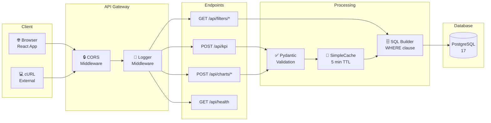

# 📡 CGM Dashboard API Documentation

Полная документация по API эндпоинтам дашборда госзакупок CGM.

---

## 📋 Содержание

- [Базовая информация](#базовая-информация)
- [Архитектура API](#архитектура-api)
- [KPI Endpoints](#kpi-endpoints)
- [Charts Endpoints](#charts-endpoints)
- [Filters Endpoints](#filters-endpoints)
- [Health Check](#health-check)
- [Коды ошибок](#коды-ошибок)
- [Примеры запросов](#примеры-запросов)

---

## Архитектура API

### Request Flow



---

## Базовая информация

**Base URL:** `http://localhost:8000`

**Swagger UI:** `http://localhost:8000/docs`

**Content-Type:** `application/json`

---

## KPI Endpoints

### POST /api/kpi

Получение KPI метрик дашборда.

**Request Body:** `FilterParams` (опционально)

| Параметр | Тип | Описание |
|----------|-----|----------|
| `years` | `number[]` | Фильтр по годам (1900-2100) |
| `months` | `number[]` | Фильтр по месяцам (1-12) |
| `regions` | `string[]` | Фильтр по регионам |
| `customers` | `string[]` | Фильтр по заказчикам |
| `suppliers` | `string[]` | Фильтр по поставщикам |
| `products` | `string[]` | Фильтр по продуктам |
| `date_from` | `string` | Дата от (YYYY-MM-DD) |
| `date_to` | `string` | Дата до (YYYY-MM-DD) |

**Response:** `KpiData`

```json
{
  "total_amount": 23492063000.0,
  "contract_count": 1802,
  "avg_contract_amount": 13036672.64,
  "total_quantity": 5596485.0,
  "avg_price_per_unit": 4197.65,
  "customer_count": 257
}
```

| Поле | Тип | Описание |
|------|-----|----------|
| `total_amount` | `number` | Общая сумма закупок (₽) |
| `contract_count` | `number` | Количество контрактов |
| `avg_contract_amount` | `number` | Средняя сумма контракта (₽) |
| `total_quantity` | `number` | Общий объём (шт) |
| `avg_price_per_unit` | `number` | Средняя цена за единицу (₽) |
| `customer_count` | `number` | Количество заказчиков |

---

## Charts Endpoints

### POST /api/charts/dynamics

Динамика закупок по месяцам.

**Request:** `FilterParams` (опционально)

**Response:** `DynamicsData`

```json
{
  "labels": ["2024-01", "2024-02", "2024-03"],
  "amounts": [1000000, 1500000, 2000000],
  "quantities": [100, 150, 200]
}
```

| Поле | Тип | Описание |
|------|-----|----------|
| `labels` | `string[]` | Месяцы (YYYY-MM) |
| `amounts` | `number[]` | Сумма закупок по месяцам |
| `quantities` | `number[]` | Количество по месяцам |

---

### POST /api/charts/regions

Топ-10 регионов по сумме контрактов.

**Request:** `FilterParams` (опционально)

**Response:** `RegionsData`

```json
{
  "labels": ["Москва", "Санкт-Петербург", "Казань"],
  "amounts": [5000000, 3000000, 2000000],
  "counts": [100, 75, 50],
  "total": 10000000
}
```

| Поле | Тип | Описание |
|------|-----|----------|
| `labels` | `string[]` | Названия регионов |
| `amounts` | `number[]` | Сумма по регионам |
| `counts` | `number[]` | Количество контрактов |
| `total` | `number` | Общая сумма по всем регионам |

---

### POST /api/charts/suppliers

Топ-5 поставщиков + остальные.

**Request:** `FilterParams` (опционально)

**Response:** `SuppliersData`

```json
{
  "top5": {
    "labels": ["Поставщик 1", "Поставщик 2"],
    "amounts": [4000000, 3000000]
  },
  "others": 500000,
  "total": 11000000
}
```

| Поле | Тип | Описание |
|------|-----|----------|
| `top5.labels` | `string[]` | Названия поставщиков |
| `top5.amounts` | `number[]` | Сумма по поставщикам |
| `others` | `number` | Сумма остальных поставщиков |
| `total` | `number` | Общая сумма |

---

### POST /api/charts/categories

Топ-7 категорий товаров.

**Request:** `FilterParams` (опционально)

**Response:** `CategoriesData`

```json
{
  "labels": ["Товар 1", "Товар 2"],
  "amounts": [5000000, 3000000]
}
```

---

### POST /api/charts/heatmap

Тепловая карта: доля товаров по месяцам (%).

**Request:** `FilterParams` (опционально)

**Response:** `HeatmapData`

```json
{
  "products": ["Freestyle Libre", "Sinocare"],
  "months": ["2024-01", "2024-02", "2024-03"],
  "matrix": [
    {
      "product": "Freestyle Libre",
      "2024-01": 100.0,
      "2024-02": 100.0,
      "total_pct": 55.58
    }
  ]
}
```

| Поле | Тип | Описание |
|------|-----|----------|
| `products` | `string[]` | Топ-20 товаров |
| `months` | `string[]` | Все месяцы в данных |
| `matrix` | `object[]` | Матрица процентов |

---

## Filters Endpoints

### GET /api/filters/years

Список доступных годов.

**Response:** `number[]`
```json
[2024, 2025, 2026]
```

---

### GET /api/filters/months

Список доступных месяцев (1-12).

**Response:** `number[]`
```json
[1, 2, 3, 4, 5, 6, 7, 8, 9, 10, 11, 12]
```

---

### GET /api/filters/regions

Список доступных регионов.

**Response:** `string[]`
```json
["Москва", "Санкт-Петербург", "Казань"]
```

---

### GET /api/filters/customers

Список доступных заказчиков.

**Response:** `string[]`
```json
["ГБУЗ Городская больница", "ООО Медтехника"]
```

---

### GET /api/filters/suppliers

Список доступных поставщиков.

**Response:** `string[]`
```json
["Поставщик 1", "Поставщик 2"]
```

---

### GET /api/filters/products

Список доступных продуктов.

**Response:** `string[]`
```json
["Freestyle Libre", "Sinocare"]
```

---

## Health Check

### GET /api/health

Проверка подключения к базе данных.

**Response:**
```json
{
  "status": "ok",
  "records": 1802
}
```

| Поле | Тип | Описание |
|------|-----|----------|
| `status` | `string` | Статус ("ok" или ошибка) |
| `records` | `number` | Количество записей в БД |

---

## Коды ошибок

| Код | Описание | Причина |
|-----|----------|---------|
| `200` | Успех | Запрос выполнен успешно |
| `422` | Ошибка валидации | Неверный формат данных |
| `500` | Ошибка сервера | Внутренняя ошибка сервера |

### Пример ошибки 422

```json
{
  "detail": "Validation error",
  "errors": [
    {
      "type": "int_type",
      "loc": ["body", "years", 0],
      "msg": "Input should be a valid integer",
      "input": null
    }
  ]
}
```

---

## Примеры запросов

### cURL

```bash
# Получить KPI
curl -X POST http://localhost:8000/api/kpi \
  -H "Content-Type: application/json" \
  -d '{"years": [2024, 2025]}'

# Получить динамику
curl -X POST http://localhost:8000/api/charts/dynamics \
  -H "Content-Type: application/json" \
  -d '{"regions": ["Москва"]}'

# Получить список регионов
curl http://localhost:8000/api/filters/regions
```

### JavaScript (fetch)

```javascript
// Получить KPI
const kpi = await fetch('/api/kpi', {
  method: 'POST',
  headers: { 'Content-Type': 'application/json' },
  body: JSON.stringify({ years: [2024] })
}).then(r => r.json());

// Получить динамику
const dynamics = await fetch('/api/charts/dynamics', {
  method: 'POST',
  headers: { 'Content-Type': 'application/json' },
  body: JSON.stringify({})
}).then(r => r.json());
```

### Python (requests)

```python
import requests

# Получить KPI
kpi = requests.post('http://localhost:8000/api/kpi', 
                    json={'years': [2024]}).json()

# Получить динамику
dynamics = requests.post('http://localhost:8000/api/charts/dynamics',
                         json={}).json()
```

---

## Кэширование

API использует кэширование с TTL 5 минут для следующих endpoints:

- `POST /api/kpi`
- `POST /api/charts/*`

Кэш автоматически инвалидируется при изменении данных.

---

## Лимиты

| Параметр | Лимит |
|----------|-------|
| Макс. длина строки | 500 символов |
| Годы | 1900-2100 |
| Месяцы | 1-12 |
| Топ регионов | 10 |
| Топ поставщиков | 5 |
| Топ категорий | 7 |
| Топ heatmap | 20 товаров |
