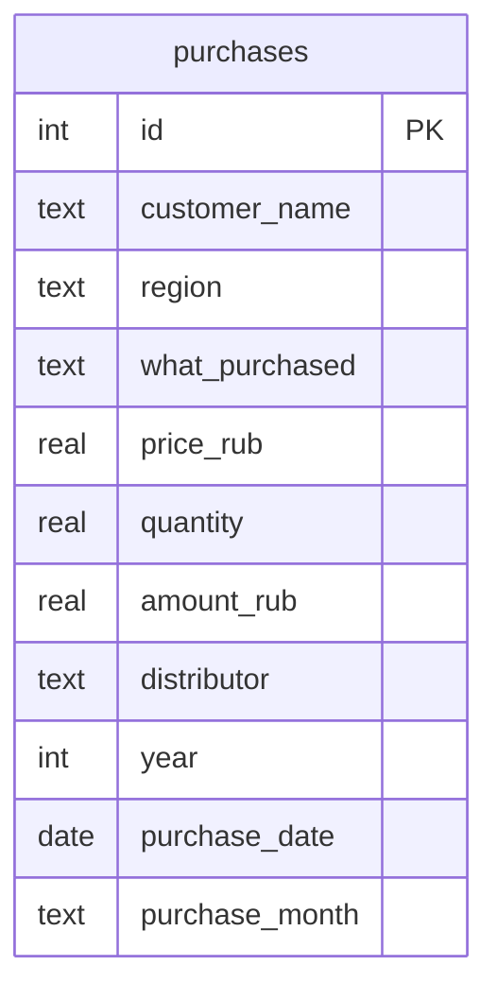
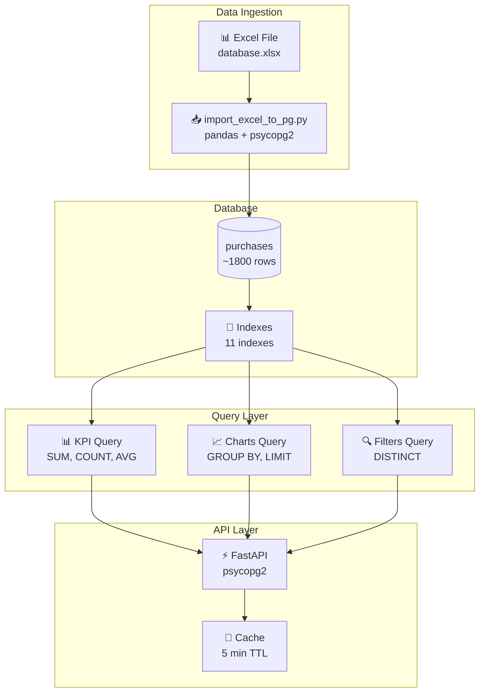
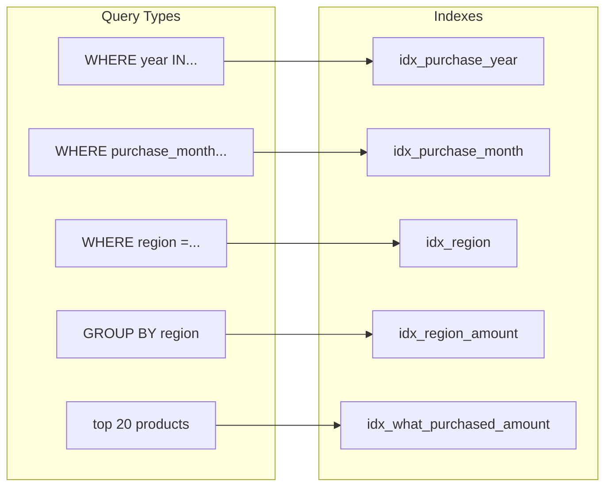

# 🗄️ Database Documentation

Документация базы данных PostgreSQL для CGM Dashboard.

---

## 📋 Содержание

- [Обзор](#обзор)
- [Архитектурные диаграммы](#архитектурные-диаграммы)
- [Схема данных](#схема-данных)
- [Индексы](#индексы)
- [Миграции](#миграции)
- [Подключение](#подключение)
- [Примеры запросов](#примеры-запросов)

---

## Архитектурные диаграммы

### ER Diagram



---

### Data Flow



---

### Index Usage



---

## Обзор

**СУБД:** PostgreSQL 17.x

**База данных:** `cgm_dashboard`

**Пользователь:** `postgres`

**Порт:** `5432`

---

## Схема данных

### Таблица: purchases

Основная таблица с данными о госзакупках.

```sql
CREATE TABLE purchases (
    id SERIAL PRIMARY KEY,
    customer_name TEXT NOT NULL,
    region TEXT NOT NULL,
    what_purchased TEXT NOT NULL,
    price_rub REAL NOT NULL,
    quantity REAL NOT NULL,
    amount_rub REAL NOT NULL,
    distributor TEXT NOT NULL,
    year INTEGER NOT NULL,
    purchase_date DATE NOT NULL,
    purchase_month TEXT NOT NULL
);
```

### Описание колонок

| Колонка | Тип | Описание | Пример |
|---------|-----|----------|--------|
| `id` | SERIAL | Уникальный ID записи | 1, 2, 3... |
| `customer_name` | TEXT | Название заказчика | ГБУЗ Городская больница |
| `region` | TEXT | Регион заказчика | Москва, Санкт-Петербург |
| `what_purchased` | TEXT | Наименование товара | Freestyle Libre |
| `price_rub` | REAL | Цена за единицу (₽) | 3500.50 |
| `quantity` | REAL | Количество (шт) | 100 |
| `amount_rub` | REAL | Сумма контракта (₽) | 350050.00 |
| `distributor` | TEXT | Название поставщика | ООО Медтехника |
| `year` | INTEGER | Год закупки | 2024, 2025 |
| `purchase_date` | DATE | Дата закупки | 2024-01-15 |
| `purchase_month` | TEXT | Месяц закупки (YYYY-MM) | 2024-01 |

### Ограничения

| Поле | Ограничение |
|------|-------------|
| `year` | 1900 ≤ year ≤ 2100 |
| `price_rub` | ≥ 0 |
| `quantity` | ≥ 0 |
| `amount_rub` | ≥ 0 |
| `customer_name` | ≤ 500 символов |
| `distributor` | ≤ 500 символов |
| `region` | ≤ 500 символов |
| `what_purchased` | ≤ 500 символов |

---

## Индексы

### Скрипт создания

**Файл:** `backend/create_indexes.sql`

```sql
-- Индекс для фильтрации по годам
CREATE INDEX IF NOT EXISTS idx_purchase_year
ON purchases(year);

-- Индекс для фильтрации по месяцам
CREATE INDEX IF NOT EXISTS idx_purchase_month
ON purchases(purchase_month);

-- Индекс для фильтрации по дате закупки
CREATE INDEX IF NOT EXISTS idx_purchase_date
ON purchases(purchase_date);

-- Индекс для фильтрации по регионам
CREATE INDEX IF NOT EXISTS idx_region
ON purchases(region);

-- Индекс для фильтрации по заказчикам
CREATE INDEX IF NOT EXISTS idx_customer_name
ON purchases(customer_name);

-- Индекс для фильтрации по поставщикам
CREATE INDEX IF NOT EXISTS idx_distributor
ON purchases(distributor);

-- Индекс для фильтрации по товарам
CREATE INDEX IF NOT EXISTS idx_what_purchased
ON purchases(what_purchased);

-- Комбинированный индекс: регион + сумма
CREATE INDEX IF NOT EXISTS idx_region_amount
ON purchases(region, amount_rub);

-- Комбинированный индекс: поставщик + сумма
CREATE INDEX IF NOT EXISTS idx_distributor_amount
ON purchases(distributor, amount_rub);

-- Индекс для группировки по месяцам и годам
CREATE INDEX IF NOT EXISTS idx_purchase_month_year
ON purchases(
    EXTRACT(YEAR FROM purchase_date),
    EXTRACT(MONTH FROM purchase_date)
);

-- Индекс для heatmap запроса (топ-20 товаров)
CREATE INDEX IF NOT EXISTS idx_what_purchased_amount
ON purchases(what_purchased, amount_rub);

-- Обновить статистику
ANALYZE purchases;
```

### Применение индексов

| Индекс | Запрос |
|--------|--------|
| `idx_purchase_year` | `WHERE year IN (2024, 2025)` |
| `idx_purchase_month` | `WHERE purchase_month LIKE '2024-%'` |
| `idx_region` | `WHERE region = 'Москва'` |
| `idx_region_amount` | `SELECT region, SUM(amount_rub) GROUP BY region` |
| `idx_distributor_amount` | `SELECT distributor, SUM(amount_rub) GROUP BY distributor` |

### Проверка индексов

```sql
-- Показать все индексы таблицы
SELECT indexname, indexdef
FROM pg_indexes
WHERE tablename = 'purchases';

-- Размер индексов
SELECT
    indexname,
    pg_size_pretty(pg_relation_size(indexname::regclass)) as size
FROM pg_indexes
WHERE tablename = 'purchases';
```

---

## Миграции

### setup_database.py

Создание базы данных и таблицы.

**Запуск:**
```bash
python setup_database.py
```

**Содержание:**
```python
import psycopg2

conn = psycopg2.connect(
    host='localhost',
    user='postgres',
    password='postgres'
)
conn.autocommit = True
cur = conn.cursor()

cur.execute("CREATE DATABASE cgm_dashboard")
cur.close()

conn = psycopg2.connect(
    host='localhost',
    user='postgres',
    password='postgres',
    database='cgm_dashboard'
)
cur = conn.cursor()

cur.execute("""
    CREATE TABLE purchases (
        id SERIAL PRIMARY KEY,
        customer_name TEXT NOT NULL,
        ...
    )
""")

conn.commit()
```

---

### import_excel_to_pg.py

Импорт данных из Excel файла.

**Запуск:**
```bash
python import_excel_to_pg.py
```

**Требования:**
- Файл `database.xlsx` в корне проекта
- Установлен `pandas`, `openpyxl`

**Структура Excel:**
| customer_name | region | what_purchased | price_rub | quantity | amount_rub | distributor | year | purchase_date |
|---------------|--------|----------------|-----------|----------|------------|-------------|------|---------------|
| ГБУЗ... | Москва | Freestyle... | 3500.5 | 100 | 350050 | ООО... | 2024 | 2024-01-15 |

---

## Подключение

### Параметры подключения

```python
DB_CONFIG = {
    'host': 'localhost',
    'port': 5432,
    'user': 'postgres',
    'password': 'postgres',  # Изменить в production!
    'database': 'cgm_dashboard'
}
```

### Переменные окружения

**Файл:** `.env`

```bash
POSTGRES_HOST=localhost
POSTGRES_PORT=5432
POSTGRES_USER=postgres
POSTGRES_PASSWORD=your_secure_password
POSTGRES_DATABASE=cgm_dashboard
```

### Пример подключения (Python)

```python
import psycopg2
from psycopg2.extras import RealDictCursor

conn = psycopg2.connect(
    host='localhost',
    port=5432,
    user='postgres',
    password='postgres',
    database='cgm_dashboard'
)

cur = conn.cursor(cursor_factory=RealDictCursor)
cur.execute("SELECT COUNT(*) FROM purchases")
print(cur.fetchone()['count'])

cur.close()
conn.close()
```

### Пример подключения (Node.js)

```javascript
const { Pool } = require('pg');

const pool = new Pool({
  host: 'localhost',
  port: 5432,
  user: 'postgres',
  password: 'postgres',
  database: 'cgm_dashboard',
});

const result = await pool.query('SELECT COUNT(*) FROM purchases');
console.log(result.rows[0].count);
```

---

## Примеры запросов

### KPI запросы

#### Общая сумма закупок
```sql
SELECT COALESCE(SUM(amount_rub), 0) as total_amount
FROM purchases;
```

#### Количество контрактов
```sql
SELECT COUNT(*) as contract_count
FROM purchases;
```

#### Средняя сумма контракта
```sql
SELECT COALESCE(AVG(amount_rub), 0) as avg_contract_amount
FROM purchases;
```

#### Количество заказчиков
```sql
SELECT COUNT(DISTINCT customer_name) as customer_count
FROM purchases;
```

---

### Charts запросы

#### Динамика по месяцам
```sql
SELECT
    purchase_month,
    SUM(amount_rub) as amount,
    SUM(quantity) as quantity
FROM purchases
GROUP BY purchase_month
ORDER BY purchase_month;
```

#### Топ-10 регионов
```sql
SELECT
    region,
    SUM(amount_rub) as amount,
    COUNT(*) as count
FROM purchases
GROUP BY region
ORDER BY amount DESC
LIMIT 10;
```

#### Топ-5 поставщиков
```sql
SELECT
    distributor,
    SUM(amount_rub) as amount
FROM purchases
GROUP BY distributor
ORDER BY amount DESC
LIMIT 5;
```

#### Топ-7 категорий
```sql
SELECT
    what_purchased,
    SUM(amount_rub) as amount
FROM purchases
GROUP BY what_purchased
ORDER BY amount DESC
LIMIT 7;
```

---

### Filter запросы

#### Доступные года
```sql
SELECT DISTINCT year
FROM purchases
WHERE year IS NOT NULL
ORDER BY year;
```

#### Доступные месяцы
```sql
SELECT DISTINCT EXTRACT(MONTH FROM TO_DATE(purchase_month, 'YYYY-MM')) as month
FROM purchases
ORDER BY month;
```

#### Доступные регионы
```sql
SELECT DISTINCT region
FROM purchases
ORDER BY region;
```

---

### С фильтрами

#### KPI с фильтром по годам
```sql
SELECT
    COALESCE(SUM(amount_rub), 0) as total_amount,
    COUNT(*) as contract_count
FROM purchases
WHERE year IN (2024, 2025);
```

#### KPI с фильтром по регионам
```sql
SELECT
    COALESCE(SUM(amount_rub), 0) as total_amount,
    COUNT(*) as contract_count
FROM purchases
WHERE region IN ('Москва', 'Санкт-Петербург');
```

#### KPI с несколькими фильтрами
```sql
SELECT
    COALESCE(SUM(amount_rub), 0) as total_amount,
    COUNT(*) as contract_count
FROM purchases
WHERE year IN (2024, 2025)
  AND region IN ('Москва', 'СПб')
  AND distributor IN ('Поставщик 1', 'Поставщик 2');
```

---

## Backup и восстановление

### Создание backup

```bash
pg_dump -U postgres -d cgm_dashboard -f backup_$(date +%Y%m%d).sql
```

### Восстановление из backup

```bash
psql -U postgres -d cgm_dashboard < backup_20240101.sql
```

### Экспорт в CSV

```sql
\COPY purchases TO 'purchases.csv' WITH CSV HEADER;
```

### Импорт из CSV

```sql
\COPY purchases (customer_name, region, what_purchased, price_rub, quantity, amount_rub, distributor, year, purchase_date, purchase_month) FROM 'purchases.csv' WITH CSV HEADER;
```

---

## Мониторинг

### Размер базы данных

```sql
SELECT pg_size_pretty(pg_database_size('cgm_dashboard'));
```

### Размер таблицы

```sql
SELECT
    relname as table_name,
    pg_size_pretty(pg_total_relation_size(relid)) as total_size
FROM pg_catalog.pg_statio_user_tables
WHERE relname = 'purchases';
```

### Количество записей

```sql
SELECT COUNT(*) FROM purchases;
```

### Статистика по годам

```sql
SELECT
    year,
    COUNT(*) as contracts,
    SUM(amount_rub) as total_amount
FROM purchases
GROUP BY year
ORDER BY year;
```

---

## Оптимизация производительности

### VACUUM

```sql
-- Очистка мёртвых кортежей
VACUUM purchases;

-- Полный VACUUM с блокировкой
VACUUM FULL purchases;

-- Анализ статистики
ANALYZE purchases;
```

### Конфигурация PostgreSQL

**Файл:** `postgresql.conf`

```conf
# Память
shared_buffers = 256MB
effective_cache_size = 1GB
work_mem = 16MB

# WAL
wal_buffers = 16MB
checkpoint_completion_target = 0.9

# Логи
log_min_duration_statement = 1000
log_checkpoints = on
```

---

## Безопасность

### Создание пользователя

```sql
CREATE USER cgm_user WITH PASSWORD 'secure_password';
GRANT SELECT ON purchases TO cgm_user;
```

### Ограничение доступа

```sql
-- Только чтение
REVOKE INSERT, UPDATE, DELETE ON purchases FROM cgm_user;

-- Доступ к определённым колонкам
GRANT SELECT (id, customer_name, region) ON purchases TO analyst;
```

### Audit логирование

```sql
-- Включить логирование всех запросов
ALTER SYSTEM SET log_statement = 'all';
SELECT pg_reload_conf();
```

---

## Troubleshooting

### Медленные запросы

```sql
-- Включить отслеживание медленных запросов
ALTER SYSTEM SET log_min_duration_statement = 100;
SELECT pg_reload_conf();

-- Проверить план выполнения
EXPLAIN ANALYZE
SELECT * FROM purchases WHERE year = 2024;
```

### Блокировки

```sql
-- Показать активные блокировки
SELECT * FROM pg_locks WHERE NOT granted;

-- Убить зависшую сессию
SELECT pg_terminate_backend(pid) FROM pg_stat_activity WHERE state = 'idle in transaction';
```

### Место на диске

```sql
-- Проверить размер всех таблиц
SELECT
    schemaname,
    tablename,
    pg_size_pretty(pg_total_relation_size(schemaname||'.'||tablename)) AS size
FROM pg_tables
ORDER BY pg_total_relation_size(schemaname||'.'||tablename) DESC;
```
