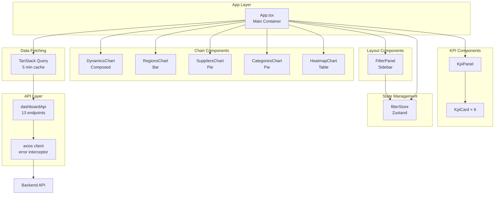
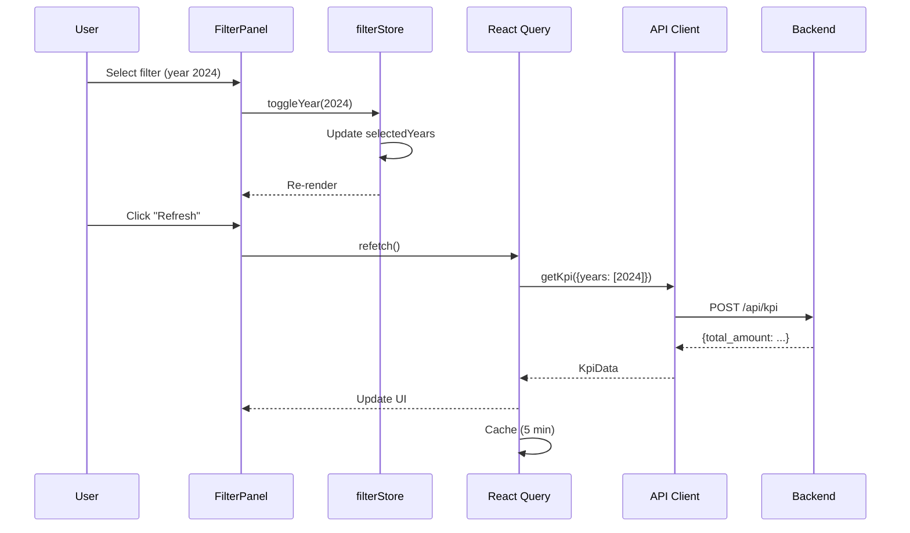
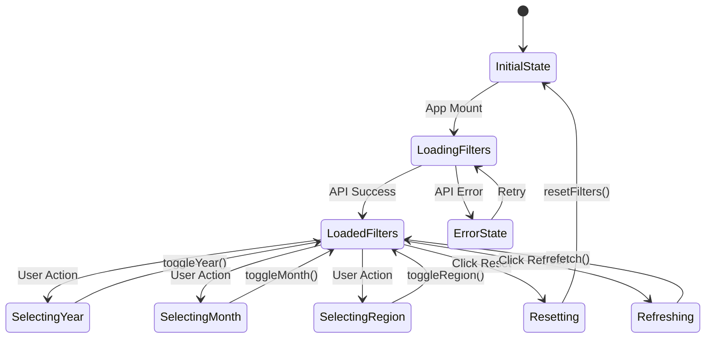

# 🏗️ Frontend Architecture

Архитектура frontend приложения CGM Dashboard.

---

## 📋 Содержание

- [Обзор технологий](#обзор-технологий)
- [Структура проекта](#структура-проекта)
- [Архитектурные диаграммы](#архитектурные-диаграммы)
- [Компоненты](#компоненты)
- [State Management](#state-management)
- [API Client](#api-client)
- [Стилизация](#стилизация)
- [Тестирование](#тестирование)

---

## Архитектурные диаграммы

### Компонентная структура



---

### Data Flow



---

### State Management Flow



---

## Обзор технологий

| Технология | Версия | Назначение |
|------------|--------|------------|
| React | 19.x | UI библиотека |
| TypeScript | 5.x | Типизация |
| Vite | 7.x | Сборщик |
| Material-UI | 7.x | UI компоненты |
| Recharts | 3.x | Диаграммы |
| Zustand | 5.x | State management |
| TanStack Query | 5.x | Data fetching |
| Axios | 1.x | HTTP клиент |

---

## Структура проекта

```
frontend/
├── src/
│   ├── api/                    # API клиент
│   │   ├── client.ts           # Axios instance
│   │   ├── index.ts            # API endpoints
│   │   └── types.ts            # TypeScript типы
│   │
│   ├── components/             # React компоненты
│   │   ├── charts/             # Компоненты диаграмм
│   │   │   ├── DynamicsChart.tsx
│   │   │   ├── RegionsChart.tsx
│   │   │   ├── SuppliersChart.tsx
│   │   │   ├── CategoriesChart.tsx
│   │   │   └── HeatmapChart.tsx
│   │   │
│   │   ├── filters/            # Компоненты фильтров
│   │   │   └── FilterPanel.tsx
│   │   │
│   │   └── kpi/                # KPI компоненты
│   │       └── KpiPanel.tsx
│   │
│   ├── stores/                 # Zustand stores
│   │   └── filterStore.ts      # Store фильтров
│   │
│   ├── App.tsx                 # Главный компонент
│   ├── main.tsx                # Точка входа
│   └── setupTests.ts           # Setup для тестов
│
├── tests/
│   └── e2e/                    # E2E тесты (Playwright)
│       ├── dashboard.spec.ts
│       └── mobile.spec.ts
│
├── package.json
├── vite.config.ts              # Vite конфигурация
├── vitest.config.ts            # Vitest конфигурация
├── playwright.config.ts        # Playwright конфигурация
└── tsconfig.json               # TypeScript конфигурация
```

---

## Компоненты

### KPI Panel

**Файл:** `components/kpi/KpiPanel.tsx`

**Ответственность:** Отображение 6 KPI карточек

**Пропсы:**
```typescript
interface KpiPanelProps {
  data: KpiData | null;
  loading?: boolean;
}
```

**Форматирование:**
- Суммы ≥ 1 млрд → `X.XX млрд ₽`
- Суммы ≥ 1 млн → `X.XX млн ₽`
- Суммы < 1 млн → `X,XXX ₽`

---

### Filter Panel

**Файл:** `components/filters/FilterPanel.tsx`

**Ответственность:** Панель фильтров (desktop + mobile)

**Фильтры:**
1. Год (кнопки, мультивыбор)
2. Месяц (кнопки, мультивыбор)
3. Регион (Autocomplete, мультивыбор)
4. Заказчик (Autocomplete, мультивыбор)
5. Поставщик (Autocomplete, мультивыбор)
6. Продукты (Autocomplete, мультивыбор)

**Адаптивность:**
- Desktop: постоянный sidebar (280px)
- Tablet/Mobile: SwipeableDrawer

---

### Chart Components

| Компонент | Файл | Тип диаграммы |
|-----------|------|---------------|
| DynamicsChart | `charts/DynamicsChart.tsx` | Composed (Bar + Line) |
| RegionsChart | `charts/RegionsChart.tsx` | Horizontal Bar |
| SuppliersChart | `charts/SuppliersChart.tsx` | Pie |
| CategoriesChart | `charts/CategoriesChart.tsx` | Pie |
| HeatmapChart | `charts/HeatmapChart.tsx` | Table with colors |

---

## State Management

### filterStore (Zustand)

**Файл:** `stores/filterStore.ts`

**State:**
```typescript
interface FilterState {
  // Выбранные значения
  selectedYears: number[];
  selectedMonths: number[];
  selectedRegions: string[];
  selectedCustomers: string[];
  selectedSuppliers: string[];
  selectedProducts: string[];

  // Доступные значения (из API)
  availableYears: number[];
  availableMonths: number[];
  availableRegions: string[];
  availableCustomers: string[];
  availableSuppliers: string[];
  availableProducts: string[];
}
```

**Actions:**
```typescript
// Установка доступных значений
setAvailableYears: (years: number[]) => void
setAvailableMonths: (months: number[]) => void
setAvailableRegions: (regions: string[]) => void
setAvailableCustomers: (customers: string[]) => void
setAvailableSuppliers: (suppliers: string[]) => void
setAvailableProducts: (products: string[]) => void

// Переключение значений
toggleYear: (year: number) => void
toggleMonth: (month: number) => void
toggleRegion: (region: string) => void
toggleCustomer: (customer: string) => void
toggleSupplier: (supplier: string) => void
toggleProduct: (product: string) => void

// Выбрать все
selectAllYears: () => void
selectAllMonths: () => void

// Сбросить фильтры
resetFilters: () => void
```

**Использование:**
```typescript
import { useFilterStore } from './stores/filterStore';

function MyComponent() {
  const { selectedYears, toggleYear } = useFilterStore();
  
  return (
    <Button onClick={() => toggleYear(2024)}>
      2024
    </Button>
  );
}
```

---

## API Client

### Axios Instance

**Файл:** `api/client.ts`

```typescript
const apiClient = axios.create({
  baseURL: '/api',
  headers: {
    'Content-Type': 'application/json',
  },
});
```

### Error Interceptor

```typescript
apiClient.interceptors.response.use(
  (response) => response,
  (error: AxiosError) => {
    if (error.response) {
      switch (error.response.status) {
        case 404: console.error('404: Данные не найдены'); break;
        case 422: console.error('422: Ошибка валидации'); break;
        case 500: console.error('500: Ошибка сервера'); break;
      }
    } else if (error.request) {
      console.error('Network error: Backend недоступен');
    }
    return Promise.reject(error);
  }
);
```

### API Endpoints

**Файл:** `api/index.ts`

```typescript
export const dashboardApi = {
  // KPI
  getKpi: async (params: FilterParams = {}): Promise<KpiData> => {
    return postQuery<KpiData>('/kpi', params);
  },

  // Charts
  getDynamics: async (params: FilterParams = {}): Promise<DynamicsData> => {
    return postQuery<DynamicsData>('/charts/dynamics', params);
  },
  
  // ... остальные endpoints
};
```

---

## Data Fetching (TanStack Query)

### Конфигурация

**Файл:** `App.tsx`

```typescript
const queryClient = new QueryClient({
  defaultOptions: {
    queries: {
      staleTime: 5 * 60 * 1000, // 5 минут
      retry: 1,
      refetchOnWindowFocus: false,
    },
  },
});
```

### Использование

```typescript
const { data, isLoading, error, refetch } = useQuery({
  queryKey: ['kpi', filterParams, refreshKey],
  queryFn: () => dashboardApi.getKpi(filterParams),
  enabled: !initError,
  refetchInterval: 5 * 60 * 1000, // Автообновление
});
```

---

## Стилизация

### Material-UI Theme

**Базовые цвета:**
```typescript
const gradients = {
  kpi1: 'linear-gradient(135deg, #00B4DB 0%, #0083B0 100%)',
  kpi2: 'linear-gradient(135deg, #11998E 0%, #38EF7D 100%)',
  kpi3: 'linear-gradient(135deg, #4A00E0 0%, #8E2DE2 100%)',
  sidebar: 'linear-gradient(180deg, #0D2B4A 0%, #1a3a5c 100%)',
};
```

### Responsive Breakpoints

```typescript
const theme = useTheme();
const isMobile = useMediaQuery(theme.breakpoints.down('md'));
const isTablet = useMediaQuery(theme.breakpoints.between('md', 'lg'));
const isDesktop = useMediaQuery(theme.breakpoints.up('lg'));
```

### Grid Layout

```typescript
<Grid container spacing={2.5}>
  <Grid size={{ xs: 12, sm: 6, lg: 4 }}>
    <KpiCard />
  </Grid>
</Grid>
```

---

## Code Splitting

**Файл:** `vite.config.ts`

```typescript
build: {
  rollupOptions: {
    output: {
      manualChunks: {
        vendor: ['react', 'react-dom'],
        charts: ['recharts'],
        ui: ['@mui/material', '@mui/icons-material'],
        utils: ['axios', '@tanstack/react-query', 'zustand'],
      },
    },
  },
  chunkSizeWarningLimit: 500,
}
```

**Результат сборки:**
| Чанк | Размер (gzip) |
|------|---------------|
| vendor.js | 0.02 KB |
| utils.js | 24.72 KB |
| ui.js | 100.20 KB |
| charts.js | 111.90 KB |

---

## Тестирование

### Unit/Component тесты

**Фреймворк:** Vitest + Testing Library

**Запуск:**
```bash
npm run test           # Запустить тесты
npm run test:coverage  # С coverage
```

**Структура тестов:**
```
src/
├── stores/__tests__/
│   └── filterStore.test.ts
└── components/
    ├── kpi/__tests__/
    │   └── KpiPanel.test.tsx
    ├── filters/__tests__/
    │   └── FilterPanel.test.tsx
    └── charts/__tests__/
        ├── DynamicsChart.test.tsx
        ├── RegionsChart.test.tsx
        └── SuppliersChart.test.tsx
```

---

### E2E тесты

**Фреймворк:** Playwright

**Запуск:**
```bash
npm run test:e2e           # Headless
npm run test:e2e:headed    # В браузере
npm run test:e2e:report    # Показать отчёт
```

**Браузеры:**
- Desktop Chrome
- Mobile Chrome (Pixel 5)
- Mobile Safari (iPhone 12)
- iPad Pro

---

## Best Practices

### 1. Типизация

```typescript
// ✅ Хорошо
interface KpiData {
  total_amount: number;
  contract_count: number;
}

// ❌ Избегайте
const data: any = await api.get();
```

### 2. Обработка ошибок

```typescript
// ✅ Хорошо
const { data, error } = useQuery({...});
if (error) console.error('Error:', error);

// ❌ Избегайте
const { data } = useQuery({...});
data.something; // Может быть undefined
```

### 3. Мемоизация

```typescript
// ✅ Хорошо
const handleClick = useCallback(() => {
  // logic
}, [dependencies]);

// ❌ Избегайте
<Button onClick={() => handleClick()} />
```

### 4. Доступность

```typescript
// ✅ Хорошо
<button aria-label="Обновить данные">
  <RefreshIcon />
</button>

// ❌ Избегайте
<button>
  <RefreshIcon />
</button>
```

---

## Производительность

### Оптимизации

1. **Code splitting** — разделение на чанки
2. **Lazy loading** — загрузка по требованию
3. **Memoization** — кэширование компонентов
4. **Virtual scrolling** — для больших списков
5. **Debounce** — для поисковых полей

### Monitoring

```typescript
// В production добавьте:
import { reportWebVitals } from 'web-vitals';

reportWebVitals((metric) => {
  console.log(metric);
  // Отправка в аналитику
});
```

---

## Развёртывание

### Development

```bash
npm run dev    # Запуск dev сервера (port 5173)
```

### Production

```bash
npm run build  # Сборка
npm run preview # Preview production сборки
```

### Docker

```bash
docker build -t cgm-frontend .
docker run -p 80:80 cgm-frontend
```
