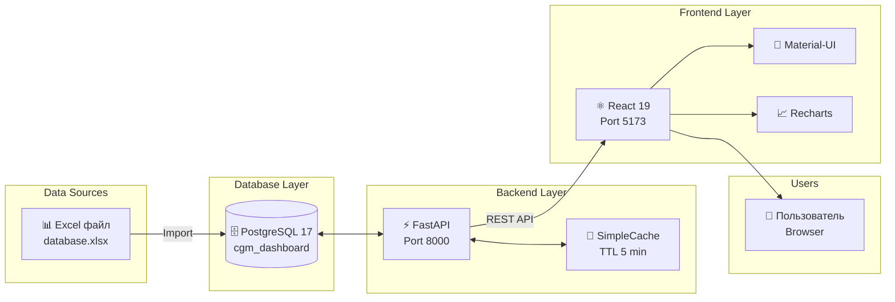

# 📚 CGM Dashboard Documentation

Добро пожаловать в документацию проекта CGM Dashboard!

---

## 🏗️ Архитектура системы

### Общая схема



### Диаграммы в документации

Каждый документ содержит архитектурные диаграммы:

| Документ | Диаграммы |
|----------|-----------|
| [API.md](API.md) | Request Flow |
| [FRONTEND_ARCH.md](FRONTEND_ARCH.md) | Component Structure, Data Flow, State Machine |
| [DATABASE.md](DATABASE.md) | ER Diagram, Data Flow, Index Usage |
| [TESTING.md](TESTING.md) | CI/CD Pipeline |
| [TROUBLESHOOTING.md](TROUBLESHOOTING.md) | Decision Tree, Health Check Flow |
| [DEPLOYMENT.md](../DEPLOYMENT.md) | Docker Architecture |
| [CONTRIBUTING.md](../CONTRIBUTING.md) | Git Flow, PR Process |

---

## 🎯 Быстрые ссылки

| Документ | Описание |
|----------|----------|
| [📡 API](API.md) | Полная документация по API endpoints |
| [🏗️ Frontend Architecture](FRONTEND_ARCH.md) | Архитектура frontend приложения |
| [🗄️ Database](DATABASE.md) | Схема БД, индексы, миграции |
| [🧪 Testing](TESTING.md) | Руководство по тестированию |
| [🔧 Troubleshooting](TROUBLESHOOTING.md) | Устранение проблем |
| [🚀 Deployment](../DEPLOYMENT.md) | Развёртывание и Docker |
| [🤝 Contributing](../CONTRIBUTING.md) | Руководство для разработчиков |

---

## 📖 Для кого эта документация

### Для разработчиков

- [Contributing Guide](../CONTRIBUTING.md) — начало работы
- [Frontend Architecture](FRONTEND_ARCH.md) — структура кода
- [Testing Guide](TESTING.md) — как писать тесты
- [API Documentation](API.md) — endpoints

### Для DevOps

- [Deployment Guide](../DEPLOYMENT.md) — развёртывание
- [Database Guide](DATABASE.md) — БД и индексы
- [Troubleshooting](TROUBLESHOOTING.md) — частые проблемы

### Для аналитиков

- [API Documentation](API.md) — как получать данные
- [Database Guide](DATABASE.md) — схема данных

---

## 🏁 Начало работы

### 1. Клонировать репозиторий

```bash
git clone <repository-url>
cd cgm_goszakupki
```

### 2. Установить зависимости

```bash
# Backend
cd backend
pip install -r requirements.txt

# Frontend
cd frontend
npm install
```

### 3. Запустить сервисы

```bash
# PostgreSQL
& "C:\Program Files\PostgreSQL\17\bin\pg_ctl.exe" start -D "C:\pg_data"

# Backend
cd backend
uvicorn main:app --reload

# Frontend (новый терминал)
cd frontend
npm run dev
```

### 4. Открыть дашборд

http://localhost:5173

---

## 📋 Содержание документации

### API Documentation

- [KPI Endpoints](API.md#kpi-endpoints)
- [Charts Endpoints](API.md#charts-endpoints)
- [Filters Endpoints](API.md#filters-endpoints)
- [Health Check](API.md#health-check)
- [Коды ошибок](API.md#коды-ошибок)
- [Примеры запросов](API.md#примеры-запросов)

### Frontend Architecture

- [Обзор технологий](FRONTEND_ARCH.md#обзор-технологий)
- [Структура проекта](FRONTEND_ARCH.md#структура-проекта)
- [Компоненты](FRONTEND_ARCH.md#компоненты)
- [State Management](FRONTEND_ARCH.md#state-management)
- [API Client](FRONTEND_ARCH.md#api-client)
- [Стилизация](FRONTEND_ARCH.md#стилизация)
- [Тестирование](FRONTEND_ARCH.md#тестирование)

### Database

- [Схема данных](DATABASE.md#схема-данных)
- [Индексы](DATABASE.md#индексы)
- [Миграции](DATABASE.md#миграции)
- [Подключение](DATABASE.md#подключение)
- [Примеры запросов](DATABASE.md#примеры-запросов)
- [Backup](DATABASE.md#backup-и-восстановление)

### Testing

- [Backend тесты](TESTING.md#backend-тесты)
- [Frontend тесты](TESTING.md#frontend-тесты)
- [E2E тесты](TESTING.md#e2e-тесты)
- [CI/CD интеграция](TESTING.md#ci/cd-интеграция)
- [Best Practices](TESTING.md#best-practices)

### Troubleshooting

- [Backend проблемы](TROUBLESHOOTING.md#backend-проблемы)
- [Frontend проблемы](TROUBLESHOOTING.md#frontend-проблемы)
- [Database проблемы](TROUBLESHOOTING.md#database-проблемы)
- [Docker проблемы](TROUBLESHOOTING.md#docker-проблемы)
- [Производительность](TROUBLESHOOTING.md#производительность)

---

## 🛠️ Технологии

### Backend

| Технология | Версия | Назначение |
|------------|--------|------------|
| Python | 3.14 | Язык программирования |
| FastAPI | 0.133+ | Web фреймворк |
| PostgreSQL | 17+ | База данных |
| psycopg2 | 2.9+ | PostgreSQL драйвер |

### Frontend

| Технология | Версия | Назначение |
|------------|--------|------------|
| React | 19+ | UI библиотека |
| TypeScript | 5+ | Типизация |
| Material-UI | 7+ | UI компоненты |
| Recharts | 3+ | Диаграммы |
| Zustand | 5+ | State management |

---

## 📊 Метрики проекта

| Метрика | Значение |
|---------|----------|
| Backend тестов | 45 |
| Frontend тестов | 37 |
| E2E сценариев | 19 |
| Backend coverage | 92% |
| Frontend coverage | 38% |
| API endpoints | 13 |
| Компонентов React | 8 |

---

## 🔗 Дополнительные ресурсы

- [GitHub Repository](#)
- [Swagger UI](http://localhost:8000/docs)
- [PostgreSQL Documentation](https://www.postgresql.org/docs/)
- [React Documentation](https://react.dev/)
- [FastAPI Documentation](https://fastapi.tiangolo.com/)

---

## ❓ Вопросы

Если у вас возникли вопросы:

1. Проверьте [Troubleshooting Guide](TROUBLESHOOTING.md)
2. Поищите в [issue tracker](#)
3. Создайте новый issue

---

## 📝 Лицензия

Внутренний проект для компании.

---

**Последнее обновление:** 5 марта 2026 г.
