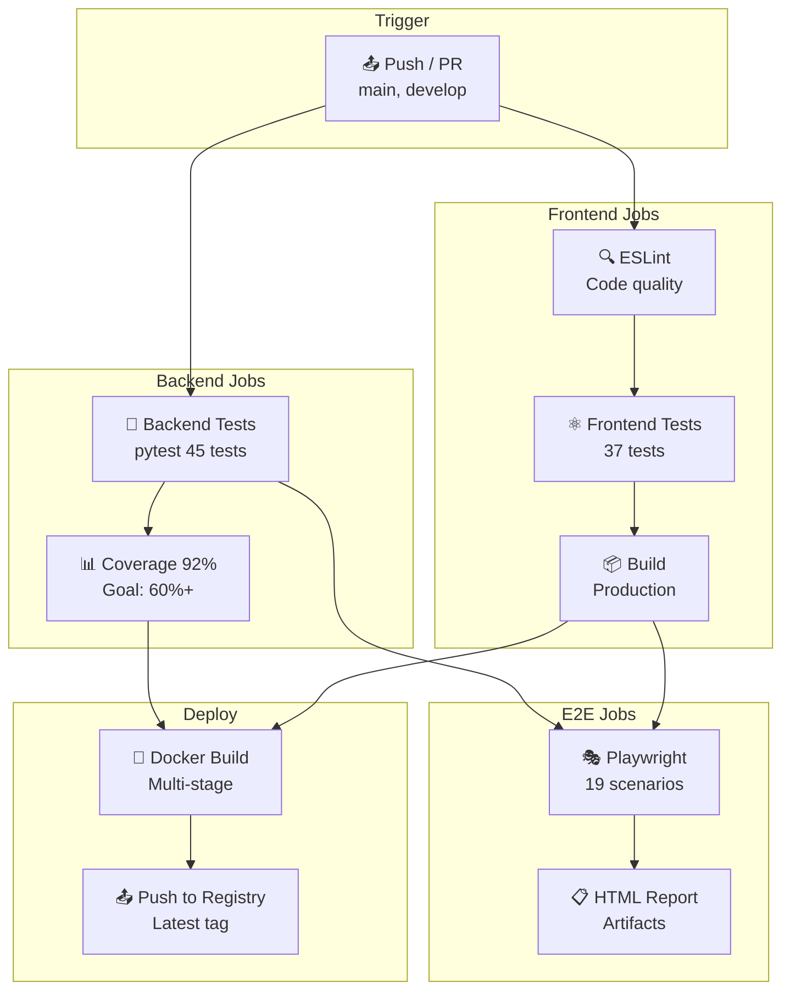

# 🧪 Testing Guide

Полное руководство по тестированию CGM Dashboard.

---

## 📋 Содержание

- [Обзор](#обзор)
- [CI/CD Pipeline](#ci/cd-pipeline)
- [Backend тесты](#backend-тесты)
- [Frontend тесты](#frontend-тесты)
- [E2E тесты](#e2e-тесты)
- [Best Practices](#best-practices)

---

## CI/CD Pipeline

### GitHub Actions Workflow



---

## Обзор

### Уровни тестирования

```
         ┌─────────────────┐
         │    E2E Tests    │  Playwright (19 тестов)
         └────────┬────────┘
                  │
         ┌────────▼────────┐
         │ Component Tests │  Testing Library (37 тестов)
         └────────┬────────┘
                  │
         ┌────────▼────────┐
         │   Unit Tests    │  Pytest (45 тестов)
         └─────────────────┘
```

### Покрытие кода

| Компонент | Coverage | Цель |
|-----------|----------|------|
| Backend | 92% | ✅ 60%+ |
| Frontend KPI | 91% | ✅ 50%+ |
| Frontend Charts | 38% | ⚠️ 50%+ |
| E2E | 19 сценариев | ✅ 10+ |

---

## Backend тесты

### Установка

```bash
cd backend
pip install pytest pytest-asyncio httpx pytest-cov
```

### Структура тестов

```
backend/
├── main.py
├── tests/
│   ├── conftest.py          # Фикстуры
│   ├── test_health.py       # Health check тесты
│   ├── test_kpi.py          # KPI endpoint тесты
│   ├── test_charts.py       # Charts endpoint тесты
│   └── test_filters.py      # Filters endpoint тесты
```

### Запуск тестов

```bash
# Все тесты
pytest tests/

# С coverage
pytest tests/ --cov=main --cov-report=term-missing

# Конкретный файл
pytest tests/test_kpi.py

# Конкретный тест
pytest tests/test_kpi.py::test_kpi_no_filters

# С выводом логов
pytest tests/ -vv -s
```

### Фикстуры (conftest.py)

```python
@pytest.fixture
def client():
    """Тестовый клиент FastAPI"""
    with TestClient(app) as client:
        yield client

@pytest.fixture
def mock_db_connection():
    """Мок подключения к БД"""
    with patch('main.get_db_connection') as mock_get_db:
        mock_conn = MagicMock()
        mock_cursor = MagicMock()
        mock_conn.cursor.return_value = mock_cursor
        mock_get_db.return_value = mock_conn
        yield mock_conn, mock_cursor

@pytest.fixture
def sample_kpi_data():
    """Пример данных KPI"""
    return {
        'total_amount': 15000000000.0,
        'contract_count': 1250,
        'avg_contract_amount': 12000000.0,
        'total_quantity': 50000.0,
        'avg_price_per_unit': 300000.0,
        'customer_count': 45
    }
```

### Пример теста

```python
def test_kpi_no_filters(client, mock_db_with_data, sample_kpi_data):
    """KPI без фильтров возвращает корректные данные"""
    mock_conn, mock_cursor = mock_db_with_data
    mock_cursor.fetchone.return_value = sample_kpi_data
    
    response = client.post("/api/kpi", json={})
    
    assert response.status_code == 200
    data = response.json()
    assert data['total_amount'] == sample_kpi_data['total_amount']
    assert data['contract_count'] == sample_kpi_data['contract_count']
```

### Тесты валидации

```python
def test_kpi_invalid_year_validation(client):
    """Валидация некорректных годов"""
    response = client.post("/api/kpi", json={"years": [3000]})
    
    assert response.status_code == 422

def test_kpi_invalid_month_validation(client):
    """Валидация некорректных месяцев"""
    response = client.post("/api/kpi", json={"months": [13]})
    
    assert response.status_code == 422
```

### Тесты кэширования

```python
def test_kpi_cache(client, mock_db_with_data, clear_cache, sample_kpi_data):
    """Кэширование KPI запросов"""
    mock_cursor.fetchone.return_value = sample_kpi_data
    
    # Первый запрос
    response1 = client.post("/api/kpi", json={})
    
    # Второй запрос (из кэша)
    response2 = client.post("/api/kpi", json={})
    
    assert response1.json() == response2.json()
```

---

## Frontend тесты

### Установка

```bash
cd frontend
npm install
```

### Структура тестов

```
frontend/
├── src/
│   ├── stores/__tests__/
│   │   └── filterStore.test.ts
│   ├── components/
│   │   ├── kpi/__tests__/
│   │   │   └── KpiPanel.test.tsx
│   │   ├── filters/__tests__/
│   │   │   └── FilterPanel.test.tsx
│   │   └── charts/__tests__/
│   │       ├── DynamicsChart.test.tsx
│   │       ├── RegionsChart.test.tsx
│   │       └── SuppliersChart.test.tsx
│   └── setupTests.ts
```

### Unit тесты (Vitest)

**Запуск:**
```bash
npm run test           # Запустить тесты
npm run test:coverage  # С coverage
npm run test:ui        # UI режим
```

**Пример теста store:**
```typescript
import { describe, it, expect, beforeEach } from 'vitest';
import { useFilterStore } from '../filterStore';

describe('filterStore', () => {
  beforeEach(() => {
    useFilterStore.setState({
      selectedYears: [2024],
      selectedMonths: [],
    });
  });

  it('добавляет год к выбранным', () => {
    useFilterStore.getState().toggleYear(2025);
    expect(useFilterStore.getState().selectedYears).toContain(2025);
  });

  it('удаляет год из выбранных', () => {
    useFilterStore.getState().toggleYear(2024);
    expect(useFilterStore.getState().selectedYears).not.toContain(2024);
  });
});
```

### Component тесты (Testing Library)

**Пример теста KPI:**
```typescript
import { render, screen } from '@testing-library/react';
import { KpiPanel } from '../KpiPanel';

describe('KpiPanel', () => {
  const mockKpiData = {
    total_amount: 15000000000,
    contract_count: 1250,
    avg_contract_amount: 12000000,
    total_quantity: 50000,
    avg_price_per_unit: 300000,
    customer_count: 45,
  };

  it('отображает 6 KPI карточек', () => {
    render(<KpiPanel data={mockKpiData} loading={false} />);

    expect(screen.getByText('Общая сумма закупок')).toBeInTheDocument();
    expect(screen.getByText('Количество контрактов')).toBeInTheDocument();
  });

  it('отображает скелетон при loading=true', () => {
    render(<KpiPanel data={null} loading={true} />);

    const skeletons = document.querySelectorAll('.MuiSkeleton-root');
    expect(skeletons.length).toBeGreaterThan(0);
  });
});
```

### Конфигурация Vitest

**Файл:** `vitest.config.ts`

```typescript
import { defineConfig } from 'vitest/config'
import react from '@vitejs/plugin-react'

export default defineConfig({
  plugins: [react()],
  test: {
    globals: true,
    environment: 'jsdom',
    setupFiles: './src/setupTests.ts',
    coverage: {
      provider: 'v8',
      reporter: ['text', 'json', 'html'],
    },
  },
})
```

### Setup для тестов

**Файл:** `src/setupTests.ts`

```typescript
import '@testing-library/jest-dom';

// Mock для window.matchMedia
Object.defineProperty(window, 'matchMedia', {
  writable: true,
  value: (query: string) => ({
    matches: false,
    media: query,
    addListener: vi.fn(),
    removeListener: vi.fn(),
  }),
});

// Mock для ResizeObserver
(window as any).ResizeObserver = vi.fn().mockImplementation(() => ({
  observe: vi.fn(),
  unobserve: vi.fn(),
  disconnect: vi.fn(),
}));
```

---

## E2E тесты

### Установка

```bash
cd frontend
npm install -D @playwright/test
npx playwright install --with-deps chromium
```

### Структура тестов

```
frontend/
├── tests/
│   └── e2e/
│       ├── dashboard.spec.ts    # Основные сценарии
│       ├── mobile.spec.ts       # Мобильные тесты
│       └── README.md            # Документация
├── playwright.config.ts
```

### Запуск тестов

```bash
# Все тесты (headless)
npm run test:e2e

# В браузере (headed)
npm run test:e2e:headed

# UI режим (интерактивно)
npm run test:e2e:ui

# Конкретный файл
npx playwright test tests/e2e/dashboard.spec.ts

# Конкретный браузер
npx playwright test --project=chromium

# Показать отчёт
npm run test:e2e:report
```

### Конфигурация Playwright

**Файл:** `playwright.config.ts`

```typescript
import { defineConfig, devices } from '@playwright/test';

export default defineConfig({
  testDir: './tests/e2e',
  timeout: 30 * 1000,
  fullyParallel: true,
  workers: 4,
  retries: process.env.CI ? 2 : 0,
  reporter: [
    ['html', { open: 'never' }],
    ['list'],
    ['json', { outputFile: 'test-results/results.json' }]
  ],
  use: {
    baseURL: process.env.BASE_URL || 'http://localhost:5173',
    trace: 'on-first-retry',
    screenshot: 'only-on-failure',
    video: 'retain-on-failure',
  },
  projects: [
    { name: 'chromium', use: { ...devices['Desktop Chrome'] } },
    { name: 'Mobile Chrome', use: { ...devices['Pixel 5'] } },
    { name: 'Mobile Safari', use: { ...devices['iPhone 12'] } },
    { name: 'iPad', use: { ...devices['iPad Pro'] } },
  ],
  webServer: {
    command: 'npm run dev',
    url: 'http://localhost:5173',
    reuseExistingServer: !process.env.CI,
  },
});
```

### Примеры тестов

**Базовый тест:**
```typescript
import { test, expect } from '@playwright/test';

test('дашборд загружается успешно', async ({ page }) => {
  await page.goto('/');
  
  await expect(page).toHaveTitle(/CGM/);
  await expect(page.getByText(/CGM|Госзакупки/)).toBeVisible();
});
```

**Тест KPI:**
```typescript
test('KPI карточки отображаются', async ({ page }) => {
  await page.goto('/');
  
  await expect(page.getByText('Общая сумма закупок')).toBeVisible({ timeout: 10000 });
  await expect(page.getByText('Количество контрактов')).toBeVisible();
});
```

**Тест фильтра:**
```typescript
test('фильтр по году работает', async ({ page }) => {
  await page.goto('/');
  
  const yearButton = page.getByText('2025').first();
  await expect(yearButton).toBeVisible();
  await yearButton.click();
  
  await expect(yearButton).toHaveClass(/contained|active/);
});
```

**Мобильный тест:**
```typescript
test('мобильная версия - загрузка', async ({ page }) => {
  await page.setViewportSize({ width: 375, height: 667 });
  await page.goto('/');
  
  await expect(page).toHaveTitle(/CGM/);
  
  const menuButton = page.getByRole('button', { name: /Фильтр|Menu/i });
  if (await menuButton.count() > 0) {
    await expect(menuButton.first()).toBeVisible();
  }
});
```

---

## CI/CD интеграция

### GitHub Actions

**Файл:** `.github/workflows/ci-cd.yml`

```yaml
name: CI/CD Pipeline

on:
  push:
    branches: [main, develop]
  pull_request:
    branches: [main]

jobs:
  backend-test:
    runs-on: ubuntu-latest
    services:
      postgres:
        image: postgres:17-alpine
        env:
          POSTGRES_PASSWORD: testpassword
        ports:
          - 5432:5432
    
    steps:
      - uses: actions/checkout@v4
      
      - name: Setup Python
        uses: actions/setup-python@v5
        with:
          python-version: '3.14'
      
      - name: Install dependencies
        run: |
          cd backend
          pip install -r requirements.txt
          pip install pytest pytest-cov
      
      - name: Run tests
        run: |
          cd backend
          pytest tests/ --cov=main --cov-report=xml
      
      - name: Upload coverage
        uses: codecov/codecov-action@v4

  frontend-test:
    runs-on: ubuntu-latest
    
    steps:
      - uses: actions/checkout@v4
      
      - name: Setup Node.js
        uses: actions/setup-node@v4
        with:
          node-version: '20'
      
      - name: Install dependencies
        run: cd frontend && npm ci
      
      - name: Run lint
        run: cd frontend && npm run lint
      
      - name: Run tests
        run: cd frontend && npm run test:coverage
      
      - name: Build
        run: cd frontend && npm run build

  e2e-test:
    runs-on: ubuntu-latest
    needs: [backend-test, frontend-test]
    
    steps:
      - uses: actions/checkout@v4
      
      - name: Setup Node.js
        uses: actions/setup-node@v4
        with:
          node-version: '20'
      
      - name: Install dependencies
        run: |
          cd frontend
          npm ci
          npx playwright install --with-deps chromium
      
      - name: Run E2E tests
        run: cd frontend && npm run test:e2e
      
      - name: Upload results
        uses: actions/upload-artifact@v4
        if: failure()
        with:
          name: playwright-report
          path: frontend/playwright-report/
```

---

## Best Practices

### 1. Naming conventions

```typescript
// ✅ Хорошо
describe('KpiPanel', () => {
  it('отображает 6 карточек с данными', () => {});
  it('отображает скелетон при loading=true', () => {});
});

// ❌ Избегайте
it('test1', () => {});
it('click button', () => {});
```

### 2. Arrange-Act-Assert

```typescript
// ✅ Хорошо
it('добавляет год к выбранным', () => {
  // Arrange
  useFilterStore.setState({ selectedYears: [2024] });
  
  // Act
  useFilterStore.getState().toggleYear(2025);
  
  // Assert
  expect(useFilterStore.getState().selectedYears).toContain(2025);
});
```

### 3. Independent tests

```typescript
// ✅ Хорошо
beforeEach(() => {
  useFilterStore.setState({
    selectedYears: [2024],
    selectedMonths: [],
  });
});

// ❌ Избегайте
it('test 1', () => {
  useFilterStore.getState().toggleYear(2025);
});

it('test 2', () => {
  // Зависит от состояния после test 1!
  expect(useFilterStore.getState().selectedYears).toHaveLength(2);
});
```

### 4. Testing Library queries

```typescript
// ✅ Хорошо (по приоритету)
screen.getByRole('button', { name: 'Обновить' });
screen.getByLabelText('Год');
screen.getByPlaceholderText('Выберите год');
screen.getByText('2024');
screen.getByTestId('refresh-button');

// ❌ Избегайте
document.querySelector('.MuiButton-root');
```

### 5. Async testing

```typescript
// ✅ Хорошо
await waitFor(() => {
  expect(screen.getByText('Данные загружены')).toBeInTheDocument();
}, { timeout: 5000 });

// ❌ Избегайте
setTimeout(() => {
  expect(...).toBeInTheDocument();
}, 1000);
```

### 6. Mock external dependencies

```typescript
// ✅ Хорошо
vi.mock('axios', () => ({
  default: {
    post: vi.fn().mockResolvedValue({ data: { total: 100 } }),
  },
}));

// ❌ Избегайте
// Реальные HTTP запросы в unit тестах
```

---

## Troubleshooting

### Тесты падают с timeout

```typescript
// Увеличьте timeout
test('долгий тест', async ({ page }) => {
  test.setTimeout(60000);
  // ...
});
```

### Элемент не найден

```typescript
// Используйте более надёжные селекторы
await page.getByRole('button', { name: 'Обновить' }).click();

// Или подождите появления
await page.waitForSelector('[data-testid="refresh-button"]');
```

### Ложные срабатывания

```typescript
// Добавьте retry для flaky тестов
test('flaky test', async ({ page }) => {
  test.retry(2);
  // ...
});
```

### Coverage не считается

```bash
# Проверьте что пути правильные
npm run test:coverage

# Проверьте exclude в конфиге
# vitest.config.ts
coverage: {
  exclude: ['node_modules/', 'src/setupTests.ts']
}
```

---

## Отчётность

### Backend coverage

```bash
pytest tests/ --cov=main --cov-report=html
# Отчёт: htmlcov/index.html
```

### Frontend coverage

```bash
npm run test:coverage
# Отчёт: coverage/index.html
```

### E2E report

```bash
npm run test:e2e:report
# Отчёт: playwright-report/index.html
```

---

## Метрики качества

| Метрика | Значение | Цель |
|---------|----------|------|
| Backend тестов | 45 | ✅ 40+ |
| Frontend тестов | 37 | ✅ 30+ |
| E2E сценариев | 19 | ✅ 10+ |
| Backend coverage | 92% | ✅ 60%+ |
| Frontend coverage | 38% | ⚠️ 50%+ |
| CI pipeline | ✅ Зелёный | ✅ |
