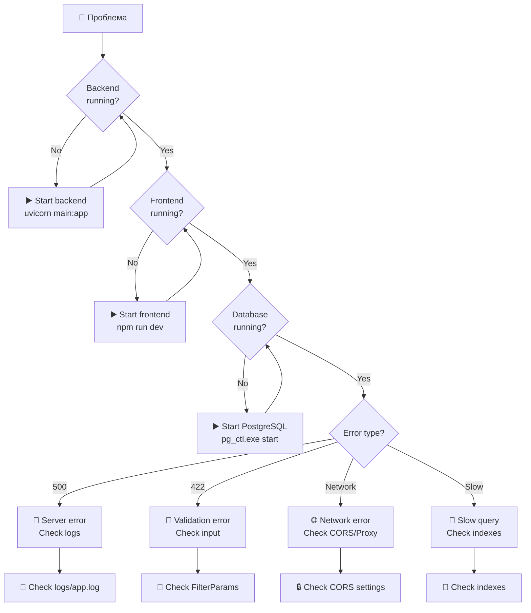
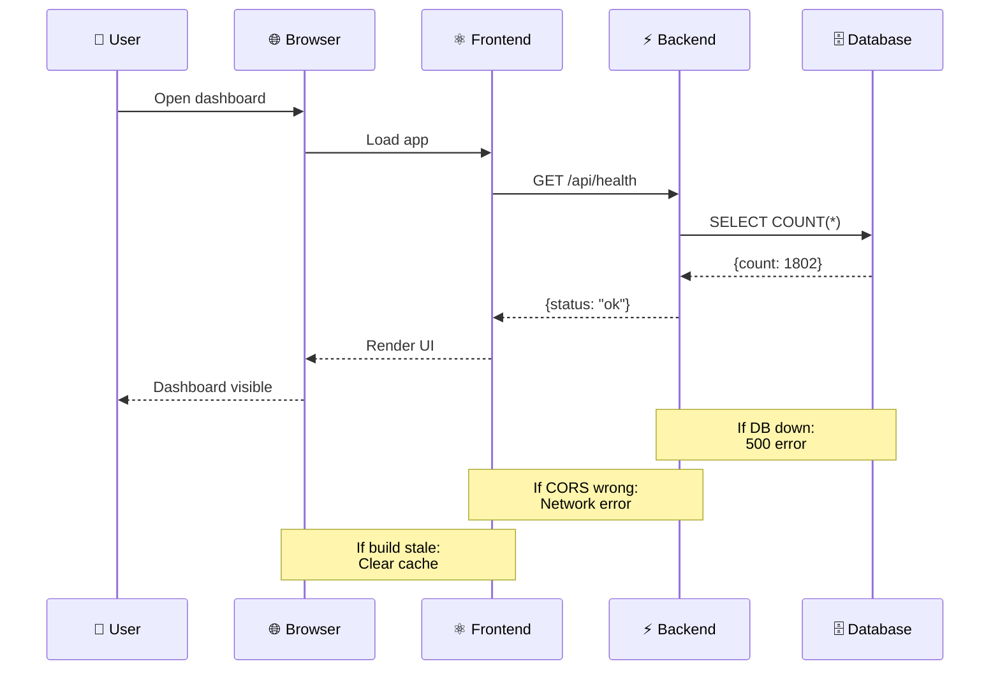

# 🔧 Troubleshooting Guide

Руководство по устранению распространённых проблем CGM Dashboard.

---

## 📋 Содержание

- [Диагностика проблем](#диагностика-проблем)
- [Backend проблемы](#backend-проблемы)
- [Frontend проблемы](#frontend-проблемы)
- [Database проблемы](#database-проблемы)
- [Docker проблемы](#docker-проблемы)
- [Производительность](#производительность)

---

## Диагностика проблем

### Decision Tree



---

### Health Check Flow



---

## Backend проблемы

### Backend не запускается

**Симптомы:**
```bash
Error: [Errno 10048] bind failed
```

**Решение:**
```bash
# Проверить что использует порт 8000
netstat -ano | findstr ":8000"

# Убить процесс
taskkill /F /PID <PID>

# Или изменить порт
uvicorn main:app --port 8001
```

---

### Ошибка подключения к PostgreSQL

**Симптомы:**
```
psycopg2.OperationalError: could not connect to server
```

**Решение:**
```bash
# Проверить запущен ли PostgreSQL
& "C:\Program Files\PostgreSQL\17\bin\pg_ctl.exe" status -D "C:\pg_data"

# Запустить PostgreSQL
& "C:\Program Files\PostgreSQL\17\bin\pg_ctl.exe" start -D "C:\pg_data"

# Проверить .env файл
cat .env
# POSTGRES_HOST=localhost
# POSTGRES_PORT=5432
# POSTGRES_USER=postgres
# POSTGRES_PASSWORD=your_password
```

---

### Ошибка импорта данных из Excel

**Симптомы:**
```
ModuleNotFoundError: No module named 'openpyxl'
```

**Решение:**
```bash
pip install pandas openpyxl psycopg2-binary
```

---

### 500 ошибка при запросе heatmap

**Симптомы:**
```
Internal Server Error
```

**Причина:** Неправильное объединение параметров SQL запроса

**Решение:** Обновить `backend/main.py` (исправлено в версии от 5 марта 2026)

---

### 422 ошибка валидации

**Симптомы:**
```json
{
  "detail": "Validation error",
  "errors": [{"type": "int_type", "msg": "Input should be a valid integer"}]
}
```

**Причина:** Frontend отправляет `null` в массивах

**Решение:** Frontend фильтрует null значения:
```typescript
years: selectedYears.filter(y => y != null)
```

---

## Frontend проблемы

### Frontend не загружается

**Симптомы:**
```
Failed to load resource: net::ERR_CONNECTION_REFUSED
```

**Решение:**
```bash
# Проверить запущен ли dev сервер
netstat -ano | findstr ":5173"

# Перезапустить
cd frontend
npm run dev
```

---

### Ошибка CORS

**Симптомы:**
```
Access to fetch at 'http://localhost:8000' has been blocked by CORS policy
```

**Решение:**
1. Проверить CORS настройки в `backend/main.py`:
```python
app.add_middleware(
    CORSMiddleware,
    allow_origins=["*"],  # Для development
    allow_credentials=True,
    allow_methods=["*"],
    allow_headers=["*"],
)
```

2. Использовать proxy в Vite:
```typescript
// vite.config.ts
server: {
  proxy: {
    '/api': {
      target: 'http://localhost:8000',
      changeOrigin: true,
    },
  },
}
```

---

### Белый фон в sidebar

**Симптомы:** При прокрутке sidebar виден белый фон

**Решение:** Обновить `frontend/src/components/filters/FilterPanel.tsx`:
```typescript
'& .MuiDrawer-paper': {
  background: 'linear-gradient(180deg, #0D2B4A 0%, #1a3a5c 100%)',
}
```

---

### Ошибка сборки TypeScript

**Симптомы:**
```
error TS2304: Cannot find name 'vi'
```

**Решение:**
```bash
# Установить типы
npm install -D vitest @types/node

# Обновить tsconfig.json
{
  "compilerOptions": {
    "types": ["vite/client", "vitest/globals"]
  }
}
```

---

### Recharts не работает в тестах

**Симптомы:**
```
The width(-1) and height(-1) of chart should be greater than 0
```

**Решение:** Это известное ограничение jsdom. Для тестирования Recharts используйте E2E тесты (Playwright).

---

## Database проблемы

### Ошибка создания базы данных

**Симптомы:**
```
psycopg2.errors.DuplicateDatabase: database "cgm_dashboard" already exists
```

**Решение:**
```sql
-- Удалить существующую базу
DROP DATABASE IF EXISTS cgm_dashboard;

-- Создать заново
CREATE DATABASE cgm_dashboard;
```

---

### Медленные запросы

**Симптомы:** Запросы выполняются > 1 секунды

**Решение:**
```sql
-- Создать индексы
\i backend/create_indexes.sql

-- Обновить статистику
ANALYZE purchases;

-- Проверить план выполнения
EXPLAIN ANALYZE SELECT * FROM purchases WHERE year = 2024;
```

---

### Ошибка валидации длины строки

**Симптомы:**
```
422: Invalid string value. Must be string with max 200 characters
```

**Причина:** Названия заказчиков длиннее 200 символов

**Решение:** Обновить лимит в `backend/main.py`:
```python
if not isinstance(item, str) or len(item) > 500:  # Было 200
```

---

### Нет данных в базе

**Симптомы:**
```json
{"status": "ok", "records": 0}
```

**Решение:**
```bash
# Импортировать данные из Excel
cd C:\Users\Дмитрий\Dashboards\cgm_goszakupki
python import_excel_to_pg.py
```

---

## Docker проблемы

### Контейнер не запускается

**Симптомы:**
```
Error starting userland proxy: bind: address already in use
```

**Решение:**
```bash
# Остановить все контейнеры
docker-compose down

# Освободить порты
netstat -ano | findstr ":8000 :5432 :80"
taskkill /F /PID <PID>

# Запустить заново
docker-compose up -d
```

---

### Ошибка сборки Docker образа

**Симптомы:**
```
ERROR: failed to solve: failed to compute cache key
```

**Решение:**
```bash
# Очистить кэш Docker
docker builder prune -a

# Пересобрать без кэша
docker-compose build --no-cache
```

---

### PostgreSQL в Docker не сохраняет данные

**Симптомы:** После перезапуска контейнера данные исчезают

**Решение:** Использовать volume:
```yaml
# docker-compose.yml
services:
  postgres:
    volumes:
      - postgres_data:/var/lib/postgresql/data

volumes:
  postgres_data:
    driver: local
```

---

## Производительность

### Медленная загрузка дашборда

**Симптомы:** Дашборд загружается > 5 секунд

**Решение:**

1. **Оптимизировать backend запросы:**
   - Проверить индексы
   - Включить кэширование

2. **Оптимизировать frontend:**
   ```bash
   # Проверить размер бандла
   npm run build
   
   # Включить code splitting (уже настроено)
   ```

3. **Проверить network:**
   - Открыть DevTools → Network
   - Найти медленные запросы

---

### Высокое использование памяти

**Симптомы:** Backend использует > 500MB RAM

**Решение:**
```python
# Ограничить размер кэша
cache = SimpleCache(ttl_seconds=300)  # TTL 5 минут

# Использовать Redis для production
```

---

### Тепловая карта долго загружается

**Симптомы:** Heatmap загружается > 3 секунд

**Решение:**
1. Ограничить топ-20 товаров (уже реализовано)
2. Добавить индекс:
```sql
CREATE INDEX idx_what_purchased_amount 
ON purchases(what_purchased, amount_rub);
```

---

## Логи

### Где найти логи

**Backend:**
```
C:\Users\Дмитрий\Dashboards\cgm_goszakupki\backend\logs\app.log
```

**Frontend:**
```
Браузер DevTools → Console
```

**Docker:**
```bash
docker-compose logs backend
docker-compose logs frontend
docker-compose logs postgres
```

---

### Включить подробное логирование

**Backend:**
```python
# main.py
logging.basicConfig(level=logging.DEBUG)
```

**PostgreSQL:**
```sql
ALTER SYSTEM SET log_min_duration_statement = 100;
SELECT pg_reload_conf();
```

---

## Проверка работоспособности

### Health check скрипт

**Файл:** `check_health.py`

```python
import requests

# Проверка backend
try:
    response = requests.get('http://localhost:8000/api/health')
    print(f"Backend: {response.json()}")
except Exception as e:
    print(f"Backend ERROR: {e}")

# Проверка frontend
try:
    response = requests.get('http://localhost:5173')
    print(f"Frontend: Status {response.status_code}")
except Exception as e:
    print(f"Frontend ERROR: {e}")
```

---

### Чеклист диагностики

1. [ ] Backend запущен (порт 8000)
2. [ ] Frontend запущен (порт 5173)
3. [ ] PostgreSQL запущен (порт 5432)
4. [ ] Health check возвращает `{"status": "ok"}`
5. [ ] В базе есть данные (> 0 записей)
6. [ ] Нет ошибок в консоли браузера
7. [ ] Нет ошибок в логах backend

---

## Контакты

Если проблема не решена:

1. Проверьте логи
2. Поищите в issue tracker
3. Создайте новый issue с:
   - Описанием проблемы
   - Шагами воспроизведения
   - Версией ПО
   - Логами
